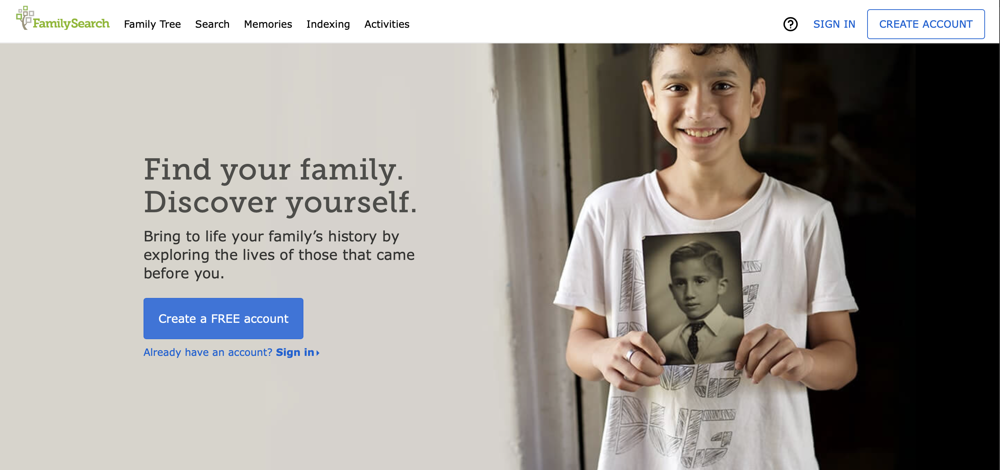

import { FaArrowAltCircleRight } from "react-icons/fa"

## FamilySearch

There are many free resources available on the
[FamilySearch website](https://www.familysearch.org/en/), with billions of historic records available.
Their library catalog is the definitive source of records, including vast arrays of books and microfilms.
Many microfilms are being digitized and indexed, with diverse records from around the world.
You can also participate in created a shared family tree that covers all of humanity.
Members of the [Church of Jesus Christ of Latter-Day Saints](https://www.churchofjesuschrist.org/) can use this site to request temple ordinances for their ancestors.

  
1

  <h3>Do you have a Church account?</h3>

If you are a member of the Church of Jesus Christ of Latter-Day Saints, you may
already have an account with one of their websites or apps. This includes the
[church website](https://www.churchofjesuschrist.org/?lang=eng) and the
[Gospel Library and Member tools apps](https://www.churchofjesuschrist.org/pages/mobileapps?lang=eng).

  <FaArrowAltCircleRight /> Click the SIGN IN button and use the username and
  password you already use.

  
2

  <h3>Are you a member of the Church of Jesus Christ of Latter-Day Saints?</h3>

You will need your membership number. The easiest way to get this is from your
profile on the Member Tools app or your temple recommend. You can also ask your
ward clerk or a member of your bishopric and they can look it up for you.

  <FaArrowAltCircleRight />
  Click on the CREATE ACCOUNT button and follow the steps there.

  
3

  <h3>Everyone else</h3>

You will still be able to access all of the resources on FamilySearch as
everyone else. The primary limitation is that you cannot see information related
to temple ordinances that members perform.

  <FaArrowAltCircleRight /> Click on the CREATE ACCOUNT button and follow the
  steps there.

## Ancestry

[Ancestry](https://www.ancestry.com/) has a wonderful collection of resources, also serving billions of historic records.
Records include US and UK census, vital records, church records, immigration and military records,
probate records. Ancestry provides hints so you can get many suggestions for potential matches with your tree. Finally, Ancestry also has the largest
DNA database so that you can find relatives from around the world.

Unlike FamilySearch, you create your own private tree on Ancestry and share it either publically or with selected
family and friends. Ancestry has a large number of public trees available.

If you are a member of the [Church of Jesus Christ of Latter-Day Saints](https://www.churchofjesuschrist.org/), you can get a free accountat Ancestry.
Visit the [partner access page](https://www.familysearch.org/campaign/partneraccess/) for the link to sign up.

## Other free Accounts

The [partner access page](https://www.familysearch.org/campaign/partneraccess/) also has free accounts for
members of the Church of Jesus Christ of Latter-Day Saints with [Find My Past](https://www.findmypast.com/), [MyHeritage](https://www.myheritage.com/),
[American Ancestors](https://www.americanancestors.org/index.aspx), [Filae](https://en.filae.com/v4/genealogie/HomePage.mvc/welcome) (a French site), and
[Geneanet](https://en.geneanet.org/).
