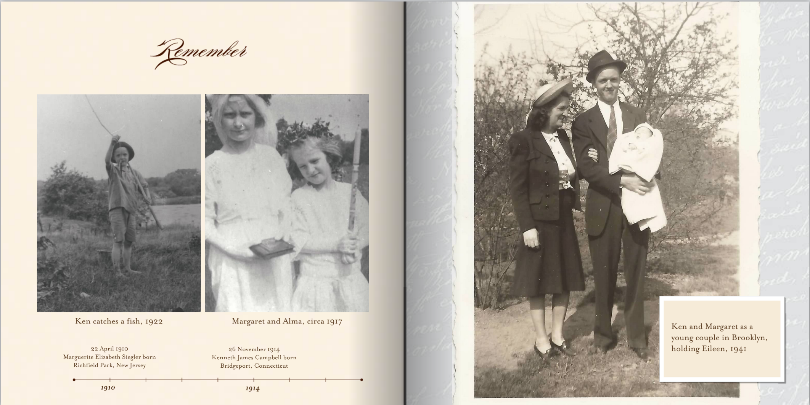

I'm writing this during the 2020 coronavirus pandemic, with many of us shut
indoors. This is a difficult time. One way to change up what you've been doing
is to learn more about your family. To give you some ideas, I'm listing here
some of the things I’ve done and some things I hope to do someday. I hope this
gives you a sense of the breadth of possibilities, and these are certainly ideas
that you can invest your time in after the pandemic is over as well.

## Participate in indexing projects

One of the reasons why genealogy has become much easier recently is because we have billions of records stored online, with many of these indexed. Indexing means you can digitally search for the information in the records, instead of having to examine and read each page manually. It saves a lot of time!

FamilySearch uses volunteers for indexing and they always needs help with
[indexing projects](https://www.familysearch.org/indexing/). These often do
not take much time, maybe 5 or 10 minutes for a single batch. All you need for
this is a free account and web browser. You can especially help out if you know
a foreign language. The
[project page](https://www.familysearch.org/indexing/projects) lists projects
from all around the world:

I was able to help index some birth records from Camporeale, a small town
outside of Palermo in Sicily:

## Collect photos of your ancestors

One of the areas where I need to do much more work is adding photos to my tree
on FamilySearch. You can do the same on Ancestry. If you view your FamilySearch tree as a fan chart, then select Photos, you
can see which direct ancestors have photos. You can see from my tree that I
don’t have many photos at all. I plan to ask my parents what kinds of photos
they have that I can add to our tree.

You can upload photos for a person in the Memories tab:

## Interview your living family members

One of the things I wish I had done years ago was visit my grandparents, turn on
a video camera or my phone to record them, and ask them questions about their
life. What sorts of games did they play as kids? What was their favorite family
vacation? How did they meet and fall in love? Sadly, my grandparents passed away
before I could do this, and now many of these stories may be gone. But it’s not
too late to do this with my parents and aunts and uncles!

One of the interesting questions to ask is how would these recordings be
preserved for your children and grandchildren to see and hear? You could
certainly keep multiple copies of videos on DVDs, or upload them to YouTube. For
audio recordings, another option is to upload them to FamilySearch, in the
Memories tab.

You can also add audio recordings and photos directly in the
[Family Tree app](https://www.familysearch.org/blog/en/mobile/) for your phone:

## Create family history books

One of my favorite things to do is to collect photos and documents from my
family and make them into books. I use Shutterfly, but there are numerous
services that will do this for you. I like to give them as Christmas presents or
bring them to family reunions, and I often have relatives ask me to make them a
copy.

You can also do this with your family photos:

## Connect with living cousins

I have enjoyed connecting with cousins on Facebook or with text messages. You
could create a descendancy tree from your great-grandparents downward, trying to
track all of the children in each family. Where are they living now and what are
they doing?

## Document your nearest ancestors

Recently I decided I wanted to get documents nobody had gotten before in my
family — the birth, marriage, and death records for my grandparents. This is
pretty easy to do if your grandparents or great-grandparents lived in the U.S. —
you just need to find the state and county where they lived and then write a
letter to the county clerk using a form on their website. It usually costs
$10-$20.

When I did this I found out my grandmother’s middle name was not Elizabeth, as
she told us her whole life, but Regina. It turns out she didn’t like that name
and chose a new one for herself. I also found out that she lied about her age.
She claimed she was 24 and born in 1915 when she was actually 29 and born
in 1910. This was pretty common back then, and she probably wanted to appear
younger than her husband, who was 25.

## Find a new ancestor

If you’re looking to find a previously unknown ancestor, try to look for someone
who lived in the 1800s or early 1900s. These are the years when the most records
are available, and if you’re new to research it’s helpful to start out during
times when research is easier.

Start by looking at your direct ancestors, and if you don't see any gaps in that
range of years, then try clicking into some of the families and examining
whether there are any areas to fill in: someone whose spouse is missing, or
perhaps a family with only one child when there are likely more. For example,
one of my families has a clear gap where there could be more children in the
family:

If clicking around looking for gaps doesn’t get you closer, you can use a free
site called [Puzzilla](https://puzzilla.org/) that will help you to do
descendancy research. When you first log in, it shows you a tree view of your
direct ancestors, with blue and pink squares standing for men and women,
respectively:

If you click on one of your most distant ancestors, then click “Descendants”,
you will see a descendancy tree:

The blue dot with the circle around it, near the top, is the relative I clicked
on, showing all the descendants of my great-great-great-great grandfather
Mariano Zappalà. The lines going out from him are his 13 children. The ones with
a yellow square are those that died as children. Any that then have additional
lines radiating from them are his grandchildren, and so on. You can pretty
easily see the line that leads to me. This leaves many other descendancy lines
unexplored, which are opportunities to find who got married and had children of
these descendants. You can also easily see families that had fewer than the
typical number of children (for an Italian Catholic family) and see potential
opportunities to find additional children (or sometimes a person whose spouse
died and had children with a second spouse).

Once you find a person to do research on — hopefully in the 1800s or early 1900s
— and you know which country they lived in, then you can check FamilySearch and
Ancestry for digitized records using their search engine. You can also search
the
[Family History Library Catalog](https://www.familysearch.org/search/catalog)
for the country, state, county, or town they lived in to see potential records
that are not indexed yet. Many are digitized and you just need to page through
them. Another good reference is the
[FamilySearch Wiki](https://www.familysearch.org/wiki/en/Main_Page), which has
many good pages describing what kind of records are available in each area of
the world and where to find them.

You can also use this view to look for any gaps or blank spots in your tree.
Choose 7 generations to see how far back you can go.

## Find an ancestor to take to the temple

If you are a member of the Church of Jesus Christ of Latter-Day Saints, you may
want to find an ancestor for whom you can do temple ordinances. Start by looking
at your direct ancestors. In the fan chart view, you can turn on Ordinances and
see which are available, need information, or are in progress. The white are
finished.

## Closing thoughts

We’ve had many wonderful experiences doing these kinds of activities. It’s been
difficult at times, but also extremely rewarding. We have built stronger family
connections among my relatives, learned about ancestors we never knew existed,
and had some wonderful visits to the temple to do ordinances for them. We have
always felt God helping us along the way, and we certain he will help you too.
