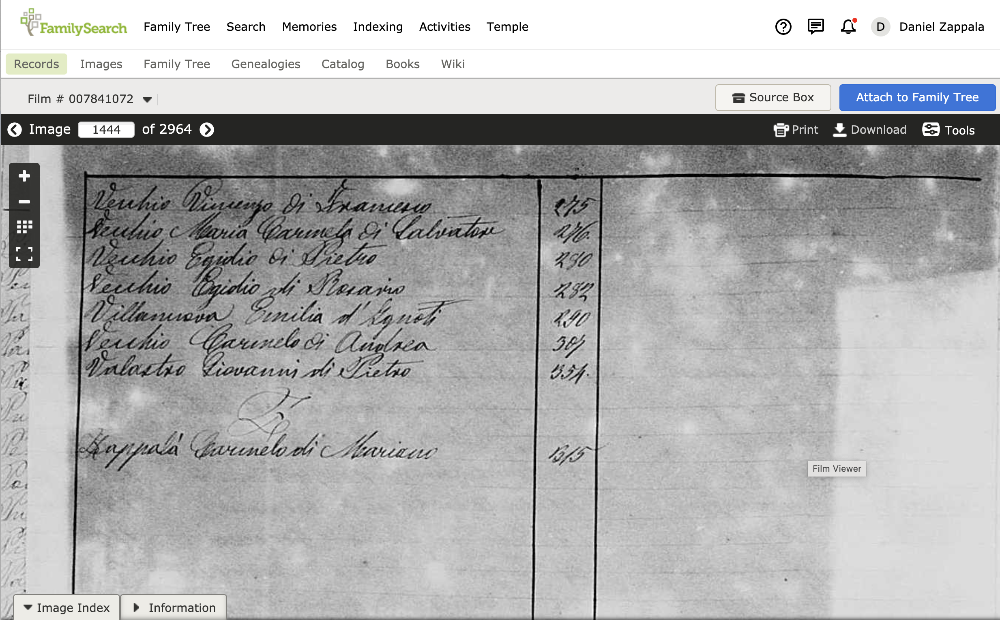

We're going to look for the birth record for Carmelo Zappala. We know from the sources we used in [Making the Jump](./making-the-jump) that he was born 6 October 1886 in Linguaglossa, Catania, Italy.

## Family History Library Catalog

The [Family History Library](https://www.familysearch.org/family-history-library/welcome-to-the-family-history-library) has birth records for many towns in Italy, and many of these have been digitized. To find if records are available for your ancestor's town, start with the Family History Library Catalog:

By default, the catalog is setup to search by place. Enter the name of a town or
city, called a `comune` in Italian. The catalog has an excellent place service
that will narrow down the possible places as you type:

Once you click the `Search` button, you will see the records the Family History
Library has for this place. I entered the town of `Linguaglossa`, since this is
where prior records we search say that Carmelo was born.

If you expand the link for civil registration, you can see these collections of records that are
available:

We want the records for Linguaglossa from 1820--1929, since Carmelo was born in 1886. If you click on the link and scroll down, you will see a
long list of (digitized) microfilms:

Birth records are listed under the italian name for birth: `nati`. We want the ones that include 1886:

These cover births from 1875 (continued from the previous film) through 1893. After that are records called Pubblicazioni, which are marriage announcements. Notice at far right is an image of a camera with a key over it -- this means you need to login to access these records. Often this means the records are only available to members of the Church of Jesus Christ of Latter-Day Saints. When I sign in, at the top right of the page, I see just a camera, indicating they are available for me to view:

## Digitized microfilms

When you click on the camera image to view a film, you will see a digitized version of the microfilm:

Throughout the film the sections are denoted by images like this:

The important things to note here are on the right side -- this is for the province of Catania, the comune (or town) of Linguaglossa, a civil registration (stato civile registro) of birth certificates (atti di nascita), for the years (anni) 1875 to 1884. The big number 1 indicates it is the first section of this film. Note that this corresponds to the catalog entry shown above. The second section should be the pubblicazioni or marriage announcements.

Look at the floating menu at the top left of this image. From top to bottom these are buttons to increase magnification (+), decrease magnification (-), toggle between a single and multiple images, and view in full screen mode.

In each section of the digitized film you will see book covers like the one shown below:

This reads city (Municipo) of Linguaglossa, register (registro) for births (le nascite), 1875. The first page of the book will look like this:

You can see the year, the name of the comune, the province, and the fact that these are birth records. Notice that this says Part (parte) 1. Sometimes if there were many births, the records may include a part 2. You may need to check both parts.

If you are lucky, you can go to the end of the book and find an index for that year:

In this case, the entries in the book are indexed by last name and show the first name of the child and the father (e.g., the second entry is Ardizzone Carmela di Nunziato, which is Carmela Ardizonne, daughter of Nunziato). The number shown in this case is the entry number (there are multiple entries per page).

Sometimes the index is sorted alphabetically by last name. Sometimes the numbers are page numbers. Sometimes the index is just shown in chronological order and not alphabetized at all. Sometimes there is no index. Sometimes there are indexes for every 10 years. If there are multiple parts for a single year, sometimes there is an index for each and sometimes an index that covers both parts, and sometimes names in one part were left out of the index. It all depends on what the clerk (or priest for religious records) chose to do!

## Carmelo Zappala's birth record

We want to find the book that begins with the births for 1886. You can zoom out to view multiple pages at once and then scroll and look for the start of each book. As you get more practice you can zoom out and jump ahead by 100s of pages (using the entry at top left for page number), and then look for the start of books to see if you have jumped ahead enough.

The book for 1886 births starts on page 1293:

There is an index at the back of the book, and since we are looking for Carmelo Zappala, he will be at the end of the index:

The entry says that Zappalà Carmelo di Mariano, or Carmelo Zappalà, son of Mariano, is found in entry 315. From here we can go backward to find that entry. If you are just learning Italian, you will need to read numbers as they are written out in long form. So we are looking for `trecentoquindici`. You can use Google Translate to help you figure this out, but some practice you will quickly learn the numbers: `tre` for three, `cento` for hundred, `quindici` for fifteen.

Here is the record!

You can see that this form is typed, which is fairly common for this time period. Earlier records may be written out in cursive. On the right is the number of the record, `trecentoquindici`, and the name of the baby, surname first, Zappalà Carmelo. Sometimes the surname is written first, sometimes last.

## Getting the basic information

Since many of these forms are identical, you usually are looking for the unique information for this certificate, which is handwritten on the form. The following are the main items you want to look for.

The date the birth was recorded occurs on the 1st line in this form. This reads `L'anno milleottocentottantasei, addì nove di Ottobre`, which is the year 1886 on the ninth of October. This is _not_ necessarily the date of the birth, but is the date it was recorded.

The person reporting the birth is shown on the 6th line in this form, surname first, Zappalà Mariano, his age, `trentasei` or 36, and his occupation, `carbonaio` or coal seller. This is often the father but sometimes another relative or a midwife is listed. We can clarify this later on the form.

The date of the birth is on the 8th line in this form, `sei` (6) of the `corrente mese` or current month, which is October.

The address where the birth occurred is on the 9th line in this form, at home, on via Cappuccini.

The name of the mother is on the same line, surname first, Nicotra Maria, `sua moglie` or his wife. This clarifies that Mariano, listed above, is the father.

The gender of the baby is on the 11th line, `mascolino` or masculine.

THe name of the baby, Carmelo, is on the 12th line.

Keep in mind that these forms vary over time and across different towns. There are only a handful of forms you will typically see, however, so it is easy to get used to them with some practice.

## Translating the record

Let's go back over this record and translate it completely so you can see how this all fits together.

| Italian                                                                             | English                                                                           |
| ----------------------------------------------------------------------------------- | --------------------------------------------------------------------------------- |
| L'anno milleottocentottantasei addì nove di Ottobre,                                | The year eighteen hundred and eighty six on the ninth of October                  |
| a ore ante meridiane dieci e minuti - , nella Casa Comunale.                        | at 10am in the town hall.                                                         |
| Avanti di me Puglia Gregorio Sindaco funzionante                                    | In front of me, Gregorio Puglia, functioning mayor,                               |
| blank                                                                               | blank                                                                             |
| Uffiziale dello Stato Civile del Comune di Linguaglossa è comparso                  | officer of the civil state of the town of Linguaglossa there appeared             |
| Zappalà Mariano, di anni trentasei, carbonaio domiciliato                           | Mariano Zappalà, 36 years old, charcoal maker, living                             |
| in Linguaglossa, il quale mi ha dichiarato che alle ore pomeridiane undici e        | in Linguaglossa, who told me that at 11:30pm                                      |
| minuti trenta, del dì sei del corrente messe, nella casa posta in                   | on the 6th day of the current month, in the house on                              |
| via Cappuccini al numero - , da Nicotra Maria, sua                                  | via Cappuccini, number not listed, by Maria Nicotra, his                          |
| moglie, contadina, seco lui convivente,                                             | wife, a peasant, living with him,                                                 |
| blank                                                                               | blank                                                                             |
| è nato un bambino di sesso mascolino che egli mi presenta e a cui da il nome di     | a male child was born whom he presents to me and to whom he gives the name of     |
| Carmelo                                                                             | Carmelo.                                                                          |
| A quanto sopra e a quest'anno sono stati presenti quali testimoni Pennisi Gregorio, | To the above and to this act were present as witnesses Gregorio Pennisi,          |
| di anni sessantadue, guardia m?, e Ardizzone Francesco                              | 62 years old, guard (night watchman?), and Francesco Ardizzone                    |
| di anni cinquantadue, spazzino, ambi residenti in questo Comune.                    | 52 years old, garbageman / street cleaner / janitor, both residents in this town. |
| Letto il presente atto agl'intervenuti, si è da me solamente                        | Having read this act to those present, it was only                                |
| sottoscritto avendo detto il dichiarante e testimoni essere il letterati            | signed by me having heard registrant and witnesses to be illiterate.              |
| L'Uffizialie dello Stato Civile                                                     | The official of the civil state                                                   |
| Gregorio Puglia                                                                     | Gregorio Puglia                                                                   |

## How do you know this is the right record?

In this case, we know the exact birth date for Carmelo from his World War II draft registration card. We can be really sure we have the right birth record for him! However, if we did not know this, and only had an approximate birth year to go on, we would need to look at several years near 1886 to check if any other babies were born in this time period that were named Carmelo Zappalà. For small towns, this can be fairly easily narrowed down. For larger towns and/or more common names, you may need to find a marriage record as well, to add additional evidence. Italian marriage records typically list the names of the parents for both the bride and groom, so this can provide solid evidence that you have found the right birth record. If your relatives were married in the United States, after immigrating here, their marriage record in the states may also list their parents.
