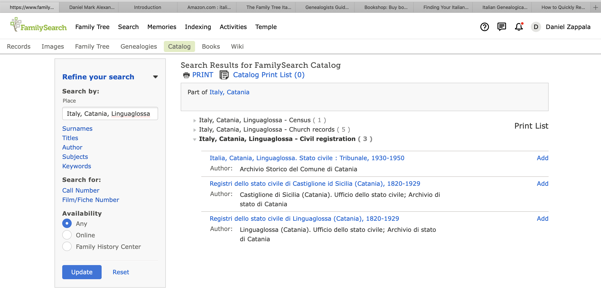
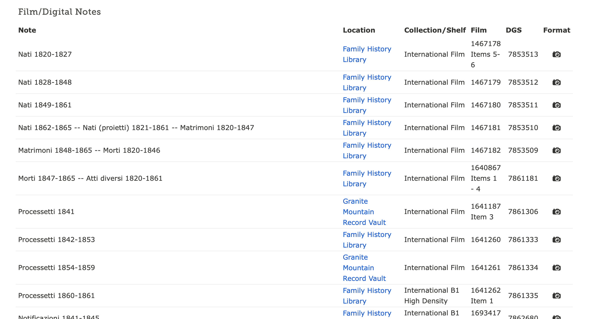

Italian genealogical records are often quite detailed and provide a wealth of information to help you trace your family. Civil records are available and microfilmed for many towns in Italy, and many of these have in turn been digitized. Digital indexing of these records is happening relatively slowly but many of the records contain analog indexes that can make searching fairly easy. Even without indexes, the records are well organized and often information is handwritten into typed forms, making them easy to read.

If you're willing to learn a few Italian genealogical words, plus some dates and numbers, you can do follow a lot of your family with relatively little knowledge of Italian back to about 1820. Going back beyond this requires reading church records that are often in Latin. By the time you get back that far, perhaps learning some additional Latin will not be too difficult.

In the following guides we will show you how to find birth, baptism, marriage, and death records from Italy. This guide gives you a brief overview of some of the resources available to help you learn about Italian genealogy.

## Books

There are some very good books to help you learn to do Italian research. As a
beginner, you could start with [The Family Tree Italian Genealogy Guide: How to Trace Your Family Tree in Italy](https://www.amazon.com/Family-Tree-Italian-Genealogy-Guide/dp/1440349053/),
by Melanie Holtz, which is also more up-to-date.

Another good book is
[Finding Your Italian Ancestors: A Beginner's Guide](https://bookshop.org/books/finding-your-italian-ancestors-a-beginner-s-guide/9781593313241),
by Suzanne Russo Adams.

The best reference is
[Italian Genealogical Records: How to Use Italian Civil, Ecclesiastical & Other Records in Family History Research](https://bookshop.org/books/italian-genealogical-records-how-to-use-italian-civil-ecclesiastical-other-records-in-family-history-research/9780916489588),
by Trafford R. Cole.

## Records at FamilySearch

FamilySearch has built an extensive collection of microfilmed records from civil
registration authorities and baptism, marriage, and death records from Catholic
churches. To search these records, visit the Family History Library Catalog, by
choosing `Search` and then `Catalog` from the
[FamilySearch](https://www.familysearch.org/en/) website:

Alternatively,
[click on this link to the catalog](https://www.familysearch.org/search/catalog).

By default, the catalog is setup to search by place. Enter the name of a town or
city, called a `comune` in Italian. The catalog has an excellent place service
that will narrow down the possible places as you type:

Once you click the `Search` button, you will see the records the Family History
Library has for this place. I entered the town of `Linguaglossa`, since this is
where one of my grandparents was born.

## Civil records

If you expand the link for civil registration, you can see these collections of records that are
available:

Generally, civil registration for birth, marriage, and death began in 1809 for
southern Italy, 1820 for Sicily, and 1866 for central and northern Italy.
Typically FamilySearch has collections of records up until about 1910, though
some more recent records have been added. You can see that for Linguaglossa, a
small town near Mount Etna in Sicily, the main collection of records is the last
one listed, comprising 1820--1929. A second set has records from a later filming
of the years 1930--1950. The records for a different town, Castiglione, which is
near Linguaglossa, are listed here only because the catalog entry indicates some
records have annotations that mention Linguaglossa.

We'll start by looking at the records from 1820--1929, since this is fairly
typical for Sicily. If you click on the link and scroll down, you will see a
long list of (digitized) microfilms:

The primary records you see here include:

- Nati (birth) -- These typically include the baby's name, the parents names,
  their ages, the father's occupation, and sometimes the address of the parents'
  home (where the baby was typically born). The mother's maiden name is usually
  listed for her last name. Some birth records contain a separate portion to
  also list baptism information. There are usually two witnesses listed on the
  record as well.

- Matrimoni (marriage) -- These typically include the names of the groom and
  bride, their ages and occupations, where they were born, and the names of
  their parents (and often their parents' ages and occupations). Some marriage
  records also list the date of the marriage notification, and a list of
  documents that were presented at the time of the marriage announcement. They
  usually list two or four witnesses of the marriage. Some marriage records
  contain a separate portion that lists the parish and date of church wedding.

- Notificazioni/Pubblicazioni (marriage notification) -- Part of the marriage
  tradition in Italy is posting a notification of the intent to marry and
  allowing anyone to object (for example if one of the bethrothed were
  previously married). The parents were also required to give consent. This
  record usually contains the same information as the marriage record.

- Allegati or Processetti (marriage documents) -- These are the documents
  presented at the time of the marriage registration (the ones sometimes listed
  on the marriage record). These typically include the birth records of the
  groom and bride and any death records for their parents (and soemtimes
  paternal grandparents). The birth and death records provided proof of identity
  and proof of death since this meant the parent could not give consent. These
  can be challenging to read and understand, and are only sometimes available,
  but they are a wonderful resource if you can find them.

- Morti (death) -- These typically include the name, age, and occupation of the
  deceased, the names and ages (if still living) of their parents, and two
  witnesses.

You will sometimes also see lesser-used records that include:

- Nati proietti (abandoned infants, usually from unwed mothers) -- These
  typically list the same information as other birth records. You will find
  births to unwed mothers also listed in the usual birth records, with a father
  listed as unknown.

- Cittadinanze (citizenship) -- These list the place of origin for new
  residents, the names of their parents, and other miscellaneous information.

- Allegati di morte/cittadinanze (documents for a death/citizenship record)

- Atti diversi (diverse records) -- A collection of various other records.

## Church records

If you expand the church records link, you can see these records that are
available:

You can see that the records are organized by the parish. There are three sets
for the `Parrochia di Santa Maria della Grazie`, or the parish of Saint Mary of
Grace. These appear to overlap, based on the years shown, but if you click
through you will find that they are mostly for different records and years.
There are also some recent records for the `Parrochia dei Santi Antonio e Vito`.

Church records in Italian towns are usually consolidated in the `chiesa madre`
or mother church, the oldest church in the town. For years, the mother church
might be the only one authorized to perform baptisms and marriages, and
permission would only come to other parish churches at a later time.

Let's focus on the records from Santa Maria della Grazie, which span a
remarkable period from 1539--1928:

These include:

- Battesimi (baptism) -- These typically include similar information as civil
  birth records. Due to the large span of years there may be varying levels of
  detail depending on the year, such as whether the age or occupation of the
  parents is listed.

- Matrimoni (marriage) -- These typically have similar information as the civil
  marriage records, but with some variability in format over the years and level
  of detail.

- Morti (death) -- These, again, are typically similar to the civil death
  records, but with variability over the years.

- Cresime (confirmations) -- These typically list the names of the children who participated in a confirmation ceremony, sometimes listing the name of the father.

## Languages to learn

To read the civil records, you will need to become familiar with some basic Italian. This may seem intimidating at first, but you can get most of the important genealogical information from a record if you can recognize names and dates, along with a small number of key words, such as `figlio di` (son of) or `figlia di` (daughter of). The [Italian Genealogical Word List](https://www.familysearch.org/wiki/en/Italian_Genealogical_Word_List) from the FamilySearch Wiki is a good reference.

Some church records may be in Italian, but many are in Latin, especially in earlier years. Older records also have handwriting that is more difficult to decipher. Again, if you look for names and dates, along with some key words you can get most information you need from the records. Consult the [
Latin Genealogical Word List](https://www.familysearch.org/wiki/en/Latin_Genealogical_Word_List) for help.

The more you practice reading these records, the better you will get.

## More information

There is extensive help available on the FamilySearch Wiki in the [section on Italian geanealogy](https://www.familysearch.org/wiki/en/Italy_Genealogy).
