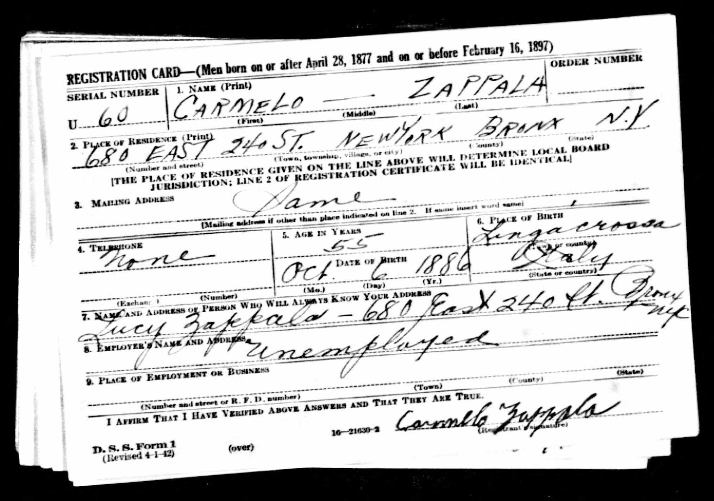

For people from the United States, the first step toward finding your family in Italian records is to make the jump from the United States to Italy. Likewise, this same step would be needed if your Italian ancestors migrated to South America, Australia, or other locations. To do this, you are looking for an ancestor who was originally born in Italy and then migrated to another country. Ultimately, you want to identify the town your ancestor was born in.

To show you how to make this jump, I'll show you some different sources while looking at my great-grandfather, Carmelo Zappala.

## The United States census

The 1930 census lists the country where your ancestor was born and the year they immigrated to the United States. Here is the [1930 census record for Carmelo Zappala](https://www.ancestry.com/imageviewer/collections/6224/images/4661134_00714?pId=30535741):

Let's focus on the part that deals with migration:

Be sure to look at all of the family. We can see that Carmelo (recorded incorrectly as Carmillo) and his wife Lucy have five children, three of whom were born in Italy like their parents. On the right, the immigration year is listed as 1910 for Carmelo and 1924 for the others. This is not too unusual that a father would migrate first and then bring his family later.

Keep in mind that these dates may be incorrect! Sometimes a family member who was interviewed for the census may not remember dates correctly or may be making their best guess.

You also want to pay attention to your ancestor's age. This helps you approximate a birth year, which you can use to find them in Italian records. In this case, Carmelo is 43, so he was born about 1887.

## Passenger lists

If your ancestor came to the United States, there is a good chance that you can find them in a passenger list. This may list the town where your ancestor last lived, which is often the town where they were born.

For Carmelo Zappala, the 1930 census suggested he may have immigrated in 1910, and it turns out he did travel to the US in 1910. This is [Carmelo Zappala in a 1910 passenger list](https://www.ancestry.com/imageviewer/collections/7488/images/NYT715_1466-0032?pId=4008194769):

Let's zoom in on the part that shows where the immigrant was from:

Here you can see that Carmelo is Italian, from the Italian South, and his last permanent residence was the town of Sersale, in Italy. Sersale is in the province of Catanzaro, in the southern part of Italy, the bottom of the "boot":

His nearest living relative there is his wife Lucia Grelli (actual spelling is Grillo).

Be aware that the census has a second page:

Zoom in on the right side:

Here you can see two columns that show place of birth. Although they are listed as Country and City or Town, in this case the first column is Linguaglossa, a town, and the second column is Catania, a province in Sicily.

This is a less common case where my ancestor moved to a new town in Italy before migrating to the United States. This tells us we should look for his birth record in Linguaglossa, but the marriage record for him and Lucia Grillo may be in Linguaglossa or Sersale.

## World War II draft registration cards

Between November 1940 and October 1946, more than 10 million American men registered for the draft for World War II. This was in response to a law requiring all men between the ages of 18 and 65 to register for the draft. At Ancestry.com you can [search all military records](https://www.ancestry.com/search/categories/39/) for your ancestor to find relevant records that mention where your ancestor was born.

I [searched these records for Carmelo Zappala](https://www.ancestry.com/search/categories/39/?name=carmelo_zappala&birth=1887&count=50&types=r) and found his [World War II draft registration card](https://www.ancestry.com/imageviewer/collections/1002/images/2wwii_2251866-1633?usePUB=true&_phsrc=gGE1&_phstart=successSource&usePUBJs=true&pId=7282193).

You can see that this shows Carmelo's current address, his wife Lucy, his age, date of birth, and place of birth. Knowing his exact date of birth of 6 October 1886 (assuming it was reported correctly here) helps a lot -- we can correlate this with any birth records we find to be sure we have a good match. Note the name of Carmelo's birth place is spelled here as Lingacrossa. If this was the only mention of the town where Carmelo was born, then you could use a gazetteer to find the properly spelled name.

Also, be sure to click for the next page in the draft registration, as this shows the reverse side of the card.

Here we see that Carmelo was 5'2", with brown eyes, gray hair, and a ruddy complexion. Details like this are part of learning your ancestor's story.

## U.S. passport applications

Ancestry has a [large collection of U.S. passport applications](https://www.ancestry.com/search/collections/1174/) as part of its larger collection of [immigration resources](https://www.ancestry.com/search/categories/40/). I was unable to find a passport application for Carmelo, but I did find one (searching for his wife, using her married name of Lucy Zappala](https://www.ancestry.com/search/categories/40/?name=Lucy_zappala&birth=1888_italy&count=50&types=r). Here is the first page of her [U.S. passport application](https://www.ancestry.com/imageviewer/collections/1174/images/USM1490_2370-0662?treeid=&personid=&hintid=&queryId=039700fc9ea2d5027372b4805809620c&usePUB=true&_phsrc=gGE9&_phstart=successSource&usePUBJs=true&_ga=2.66157032.777286220.1614656327-1878350092.1612143665&pId=215780).

There is a wealth of information in these applications! From this, we learn:

- Lucia Grillo was born 13 February 1888 in Sersale, in the province of Catanzaro, Italy.
- Carmelo Zappalà (note the accent) emigrated from the port of Naples in April 1910 and resided interruptedly in the United States, mostly in New York, until 1923.
- Carmelo was naturalized in the Circuit Court of Anne Arundel County County at Camp Meade, Maryland, on 11 December 1918. This means there are likely additional records of Carmelo's service in the military during WWI.
- Lucia applied for her passport on 4 September 1923 in the American Consulate at Messina.

There is a second page as well:

Here we see:

- the naturalization certificate number for Carmelo,
- the date of Carmelo and Lucia's marriage in Sersale, 16 February 1908, and
- a photo of Lucia Grillo dating to 1923 or earlier, by far the earliest known photo we have of her.

## Summary

Let's take a look at what we learned about Carmelo from each of these sources:

- The US Census provided an immigration year (1910), a country of origin (Italy), and an approximate year of birth (1887).
- The passenger list confirmed the immigration year (1910), the prior town of residence (Sersale, Catanzaro, Italy), a place of birth (Linguaglossa, Catania, Italy), and another approximate year of birth (1886).
- The World War II draft registration gave an exact birth date (6 October 1886) and birth place (Linguaglossa, Catania, Sicily).
- The passport application for Lucia, Carmelo's wife, confirms the immigration year (1910), gives a naturalization date and place and certificate number, and lists their marriage date (16 February 1908) and place (Sersale, Catanzaro, Italy).

The last three of these are the most helpful. Between them we know exactly where and when to look for a birth and a marriage record for Carmelo in Italy.
