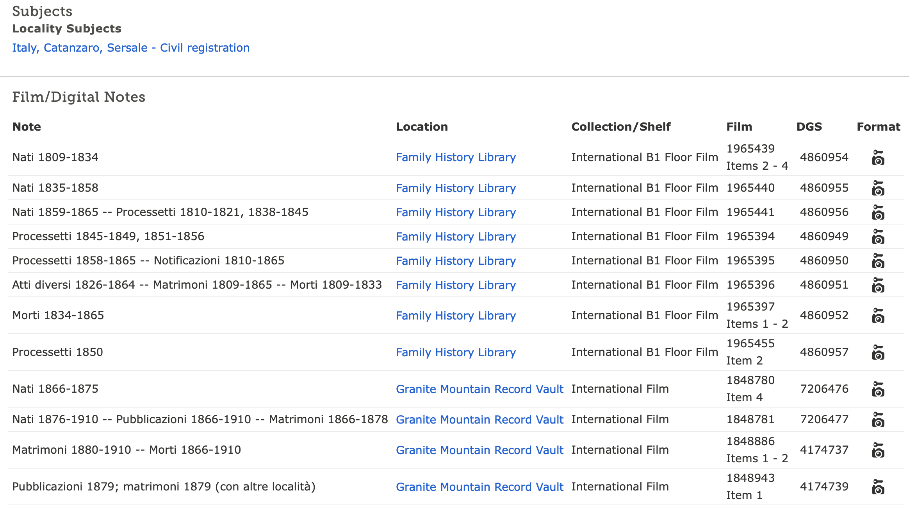
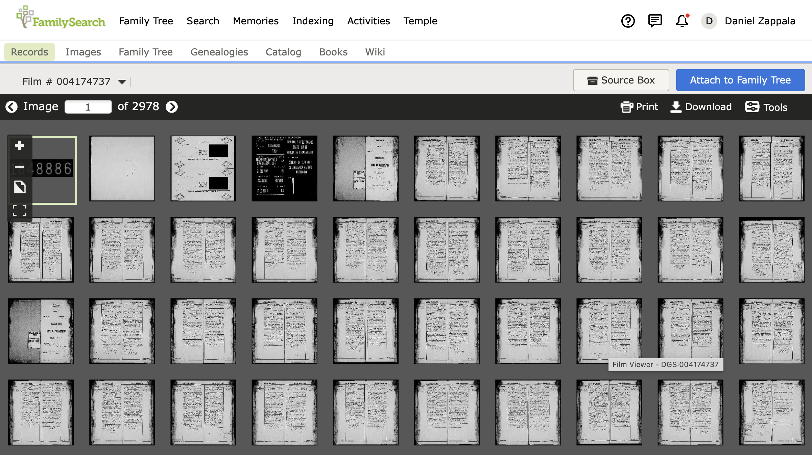
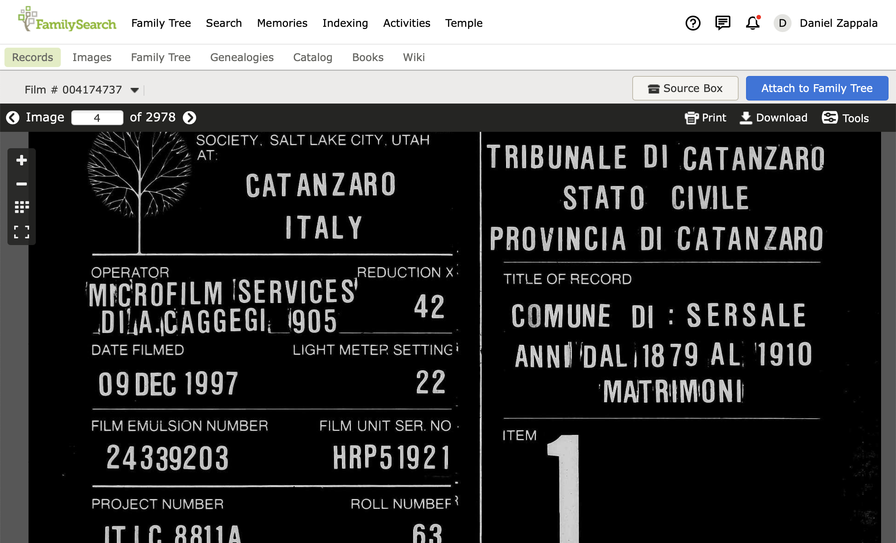
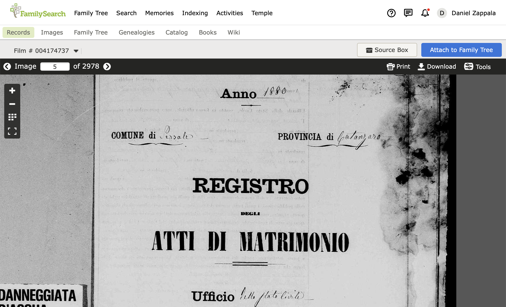
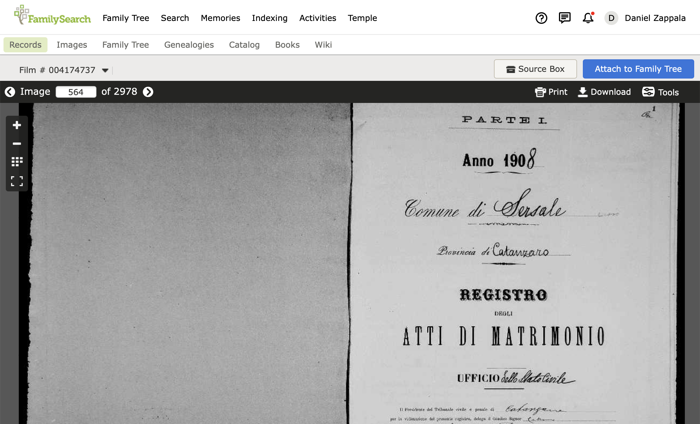
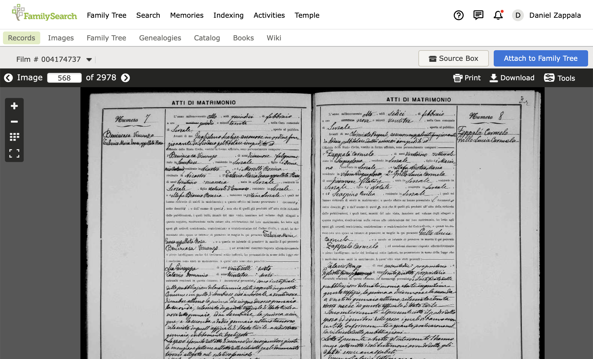
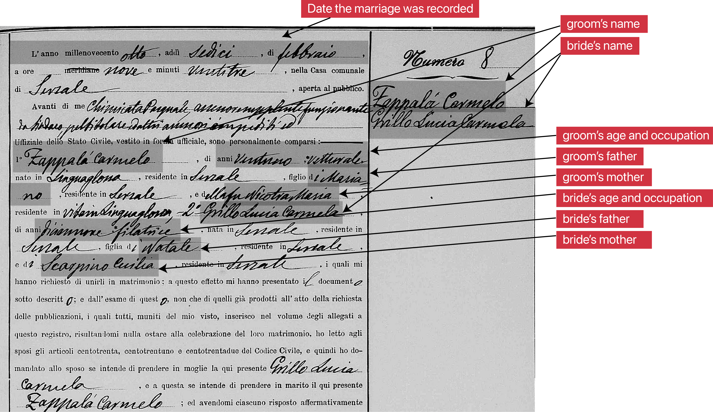
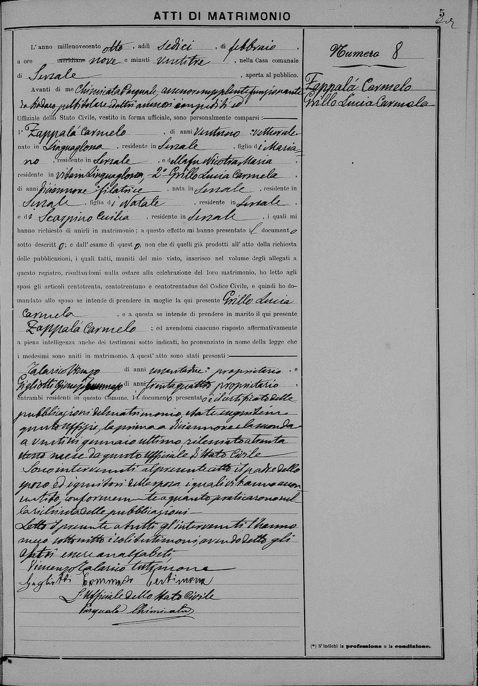
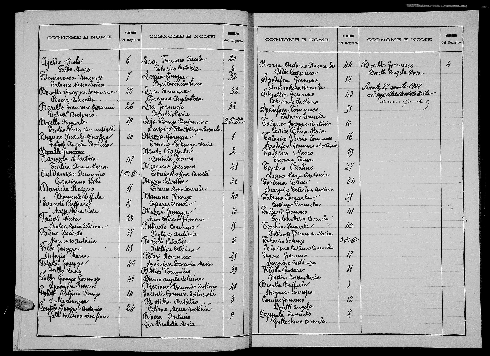

We're going to look for the marriage record for Carmelo Zappala. We know from the sources we used in [Making the Jump](./making-the-jump) that he was married to Lucia Grillo on 16 February 1908 in Sersale, Catanzaro, Italy.

## Available records

The [FamilySearch library catalog entry for Sersale](https://www.familysearch.org/search/catalog/results?count=20&placeId=113273&query=%2Bplace%3A%22Italy%2C%20Catanzaro%2C%20Sersale%22) shows that the library only civil registration available for Sersale. These records span the period from 1809 to 1910:

If you sign in to your account and are a member of the Church of Jesus Christ of Latter-Day Saints, then these records are unlocked and available for online viewing. Otherwise you may need to visit a nearby Family History Center to view them digitally.

We will look at the second-to-last entry here, which has `matrimoni` or marriage records covering 1880 to 1910.

## Searching marriage records

When you click on the camera icon on the right side of the page, you will open the digitized version of the microfilm:

Double-clicking on the image that is mostly black shows you the beginning of the first section of this film:

You can see that this covers records for the comune of Sersale, for the years (`anni`) 1879-1910, and these are `matrimoni` or marriage records.

The next page is the start of the records for 1880:

The person filming the records must have mistakenly noted these as starting in 1879.

When you zoom out and view multiple pages of the film at once, it is pretty easy to identify the start of each year of records, looking for images like those above. Sometimes there are multiple books per year (a part 1 and part 2), so you can double-click on an image periodically to be sure you are on the right track. If this goes too slowly, you can type a page number at the top left, then the enter key, and jump ahead in the film. Eventually, you can find the beginning of the records for 1908:

Since we know Carmelo and Lucia were married on 16 February 1908, we can page through the records now. It helps a lot to know the names of the months and numbers up to thirty-one in Italian! The FamilySearch wiki has a good beginner's [Italian genealogical word list](https://www.familysearch.org/wiki/en/Italian_Genealogical_Word_List). We will be looking for `febbraio`, or February, and the month is the last word on the first line of the record. Once you get the correct month, then you can look for the day, `sedici`, or sixteen. You can also look for the name of your ancestors written, in this case, in large lettering in the right or left column of the records.

Here is the marriage record for Carmelo Zappalà and Lucia Grillo:

## Getting the basic information

Let's zoom in on the marriage certificate and identify the essential information it contains. Since this is a typewritten form, the information unique to this marriage is going to be handwritten in the blank spaces.

The right column lists the name of the groom, surname first, Zappalà Carmelo, and then the name of the bride, surname first, `Grillo Lucia Carmela`.

The first line of the record contains the date the marriage was recorded, `L'anno millenovento otto addì sedici di febbraio`, the year 1908 on the 16th of February. This is the date of the civil marriage. The couple was usually also married in the Catholic chuch, which may have been the same day or may have been within the week. The Family History Library has microfilmed some church records, but not for Sersale.

The 7th line lists the name of the groom again and then his age, `ventuno`, 21, and occupation, `vetturale`, which is someone who transports goods with a pack animal or wagon. There are many lists of occupations you can find online, but I find it most accurate to [consult a good Italian dictionary](https://www.dizionario-italiano.it/dizionario-italiano.php?parola=vetturale). You can often[put the result into Google Translate](https://www.dizionario-italiano.it/dizionario-italiano.php?parola=vetturale) to get an idea of what the word means.

The 8th line lists the name of the father of the groom, `Mariano`, continuing onto the 9th line. Continuing onto the next line is very common, often with a small mark indicating the continuation, so you should look carefully for this.

The name of the groom's mother is shown at the end of the 9th line, surname first, `fu Nicotra Maria`, or the deceased Maria Nicotra. Italian records generally use a woman's maiden name. Italian also records generally include the adjective `fu` to refer to someone as [deceased](https://www.dizionario-italiano.it/dizionario-italiano.php?parola=fu).

The end of the 10th line shows the bride's name again. The 11th line lists her age, `diciannove`, 19, and occupation, `filatrice`, or spinner.

The 11th line list the bride's father, Natale, and the 12th line lists her mother, surname first, Scarpino Cecilia.

## Translating the record

Let's go back over this record and translate it completely so you can see what the entire record says. Notice that the bottom of the form is handwritten, making it a little harder to decipher what it says.

| Line | Italian / English                                                                                                   |
| ---- | ------------------------------------------------------------------------------------------------------------------- |
| 1    | L'anno millenovento otto addì sedici di febbraio                                                                    |
|      | The year 1908 on the 16th of February                                                                               |
| 2    | a ore nove e minuti ventitre, nella Casa comunale                                                                   |
|      | at 9:23am, in the town hall                                                                                         |
| 3    | di Sersale, aperta al pubblico                                                                                      |
|      | of Sersale, open to the public                                                                                      |
| 4    | Avanti di me Chimicata Pasquale, assessore supplente, funzionante                                                   |
|      | In front of me, Pasquale Chimicata, deputy councilor, functioning                                                   |
| 5    | da Sindaco, pel titolare ed altri assessori impedì di ed                                                            |
|      | Mayor, for the titled and other unavailable counselors and                                                          |
| 6    | Uffiziale dello Stato Civile, vestito in forma ufficiale, sono personalmente comparsi:                              |
|      | registrar, dressed in official form, personally appeared:                                                           |
| 7    | 1º Zappalà Carmelo, di anni ventuno, vetturale,                                                                     |
|      | (1st) Carmelo Zappalà, 21 years old, a driver (moving goods by horse or cart)                                       |
| 8    | nato in Linguaglossa, residente in Sersale, figlio di Mariano                                                       |
|      | born in Linguaglossa, resident iofn Sersale, son of Mariano,                                                        |
| 9    | residente in Sersale, e della fu Nicotra Maria,                                                                     |
|      | resident of Sersale, and of the deceased Maria Nicotra                                                              |
| 10   | residente in vita in Linguaglossa, 2º Grillo Lucia Carmela,                                                         |
|      | resident, while living, of Linguaglossa, (2nd) Lucia Carmela Grillo,                                                |
| 11   | di anni diciannove, filatrice, nata in Sersale, residente in                                                        |
|      | 19 years old, spinner, born in Sersale, resident of                                                                 |
| 12   | Sersale, figlia di Natale, residente in Sersale,                                                                    |
|      | Sersale, daughter of Natale, resident of Sersale,                                                                   |
| 13   | e di Scarpino Cecilia, residente in Sersale, i quali mi                                                             |
|      | and of Cecilia Scarpino, resident of Sersale, who                                                                   |
| 14   | hanno richiesto di unirli in matrimonio; a questo effetto mi hanno presentato il documento                          |
| 15   | have asked me to join them in marriage; to this effect they presented me with the document                          |
| 16   | sotto descritto; e dall' esame di questo, non che di quelli già prodotti all' atto della richiesta                  |
|      | described below; and from the examination of this, as well as those already produced at the time of the request for |
| 17   | delle pubblicazioni, i quali tutti, muniti del mio visto, inserisco nel volume degli allegati a                     |
|      | marriage banns, which all, sealed with my stamp, I inserted in the volume of the attachments to                     |
| 18   | questo registro, risultandomi nulla ostare alla celebrazione del loro matrimonio, ho letto agli                     |
|      | this register, resulting in nothing to prevent the celebration of their marriage, I have read                       |
| 19   | sposi gli articoli centotrenta, centotrentuno e centotrentadue del Codici Civile, e quindi ho do-                   |
|      | to the spouses the 130th, 131st, and 132nd articles of the civil code, and then I                                   |
| 20   | mandato allo sposo se intende di prendere in moglie la qui presente Grillo Lucia                                    |
|      | asked the groom if he intends to marry the here present Lucia Carmela Grillo,                                       |
| 21   | Carmela, e a questa se intende di prendere in marito il qui presente                                                |
|      | and if she intends to take the present here                                                                         |
| 22   | Zappalà Carmelo; ed avendomi ciascuno risposto affermativamente                                                     |
|      | Carmelo Zappalà as a husband; and having each answered in affirmatively                                             |
| 23   | a piena intelligenza anche dei testimoni sotto indicati, ho pronunziato in nome della legge che                     |
|      | to me with full understanding of the witnesses indicated below, I have pronounced in the name of the law that       |
| 24   | i medesimi sono uniti in matrimonio. A quest' atto sono stati presenti:                                             |
|      | they are united in marriage. At this act were present                                                               |
| 25   | Talarico Vincenzo di anni sessantadue, proprietario, e                                                              |
|      | Vincenzo Talarico, 62 years old, a proprietor,                                                                      |
| 26   | Gigliotti Giuseppe Tommaso di anni trentaquattro, proprietario,                                                     |
|      | Giuseppe Tommaso Gigliotti, 34 years old, a proprietor,                                                             |
| 27   | entrambi residenti in questo Comune. Il documento presentato è il certificato delle                                 |
|      | both residents of this town. The document presented is the certificate of the                                       |
| 28   | pubblicazioni del matriomonio, e date reguite in                                                                    |
|      | marriage banns, and dates registered in                                                                             |
| 29   | questo uffizio, la prima a diciannove e la seconda                                                                  |
|      | this office, the first on the 19th and the second                                                                   |
| 30   | a ventisei gennaio ultimo, rilessiato a trenta                                                                      |
|      | on the 26th of January last, re-read on the 30th                                                                    |
| 31   | stesso mese da questo Ufficiale di Stato Civile                                                                     |
|      | of the same month by this registrar.                                                                                |
| 32   | Sono intervenuti al presente atto il padre dello                                                                    |
|      | Those present at this act are the father of the                                                                     |
| 33   | sposo ed i genitori della sposa, i quali si hanno accon-                                                            |
|      | groom and the parents of the bride, who have                                                                        |
| 34   | sentito conformemente a quanto practicarono nel                                                                     |
|      | agreed in accordance with what they have practiced                                                                  |
| 35   | la richiesta delle pubblicazioni                                                                                    |
|      | in the request for banns.                                                                                           |
| 36   | Letto il presente a tutti gl'inervenuti l'hanno                                                                     |
|      | I read this to all present                                                                                          |
| 37   | meco sottoscritto i soli testimoni , avendo detto gli                                                               |
|      | only the witnesses have signed it with me, having said                                                              |
| 38   | altri essere analfabeti                                                                                             |
|      | the others are illiterate                                                                                           |
| 39   | Vincenzo Talarico testimone                                                                                         |
|      | Vincenzo Talarico witness                                                                                           |
| 40   | Gigliotti Tommaso testimone                                                                                         |
|      | Tommaso Gigliotti witness                                                                                           |
| 41   | L'Ufficiale dello Stato Civile                                                                                      |
|      | the registrar                                                                                                       |
| 42   | Pasquale Chimicata                                                                                                  |
|      | Pasquale Chimicata                                                                                                  |

You can see from this that a marriage record contains some additional information not shown in the section above. This includes the time the marriage record was created, the name of the registrar, the birthplace of the bride and groom, as well as where they and their parents were living, the dates their marriage banns were published and read, the witnesses (along with their ages and occupations), and a list of who was present.

## The value of marriage documents

Some marriage records may list additional documents that were presented, which may include the birth records of the bride and groom and/or a death record of a parent of the bride or groom. These documents were collected into an `allegati`, or a collection of attachments, and these in turn are sometimes microfilmed for a given town, usually only for a small range of years. They take more time to search through, but you can often find birth records, death records, and marriage records for the family all in one place, making them a quite valuable collection of records.

## What if you don't know the exact date?

We knew the exact date of Carmelo and Lucia's marriage because it was listed on Lucia's passport application. What if we didn't know an exact date?

Sometimes, each year of records has an index at the end. These are generally more common in later years and it depends on whether the clerk in a given town was careful about doing this each year. Sometimes the index is sorted alphabetically by first name, sometimes alphabetically by last name, and sometimes it is simply in chronological order. Here, we can see the 1908 index for Sersale marriage records on this film:

This one is sorted alphabetically by last name, but always check the end of the index -- sometimes extra names are added there, either if they were originally missed or if the index was made late in the year and then more marriages occurred. Often if there are two volumes in a given year, the second volume will be indexed separately.

So if there is an index, you can quickly check a range of years and try to find the record you are looking for. If there are no indexes for some years, then you will need to look through each record, page-by-page, looking for potential matches. Write down their page numbers, then examine each record to decide which is the best match.

Be aware that many families lived in the same town for years, so there are usually some surnames that are very common. In addition, Italians often re-used a small set of first names, and often named children after a parent or close relative. Combined, this means if you are looking for an ancestor whose name seems novel to you, there may in fact be several people getting born or married in the same town with that same name within a few years of each other.
