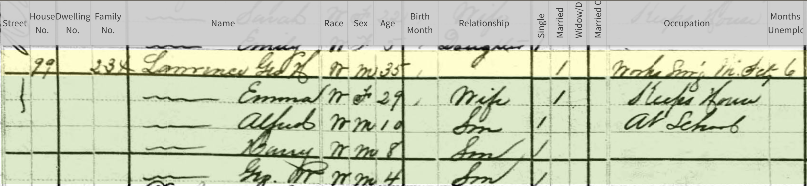
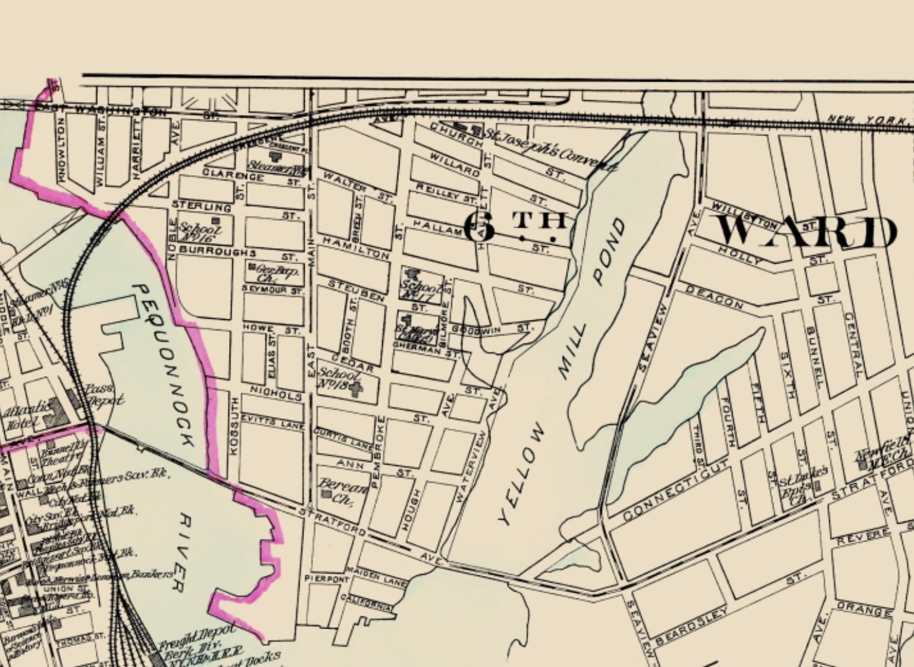
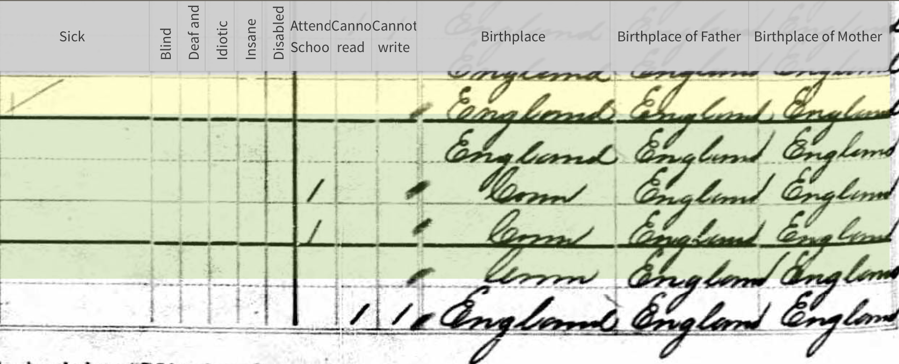
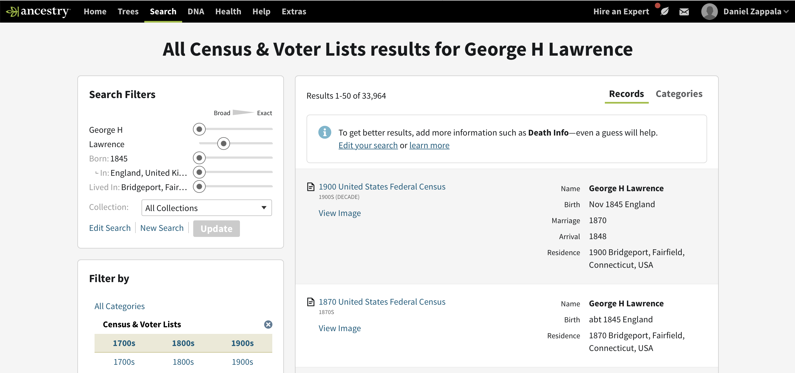
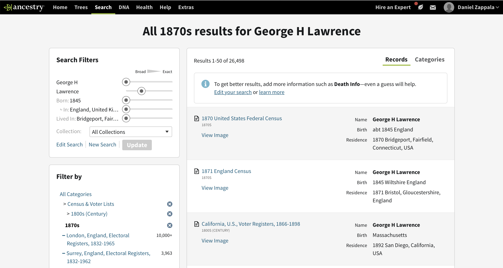
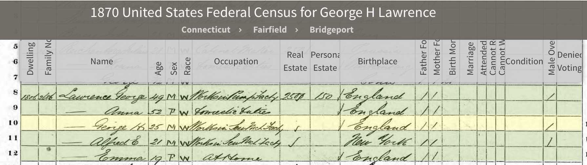
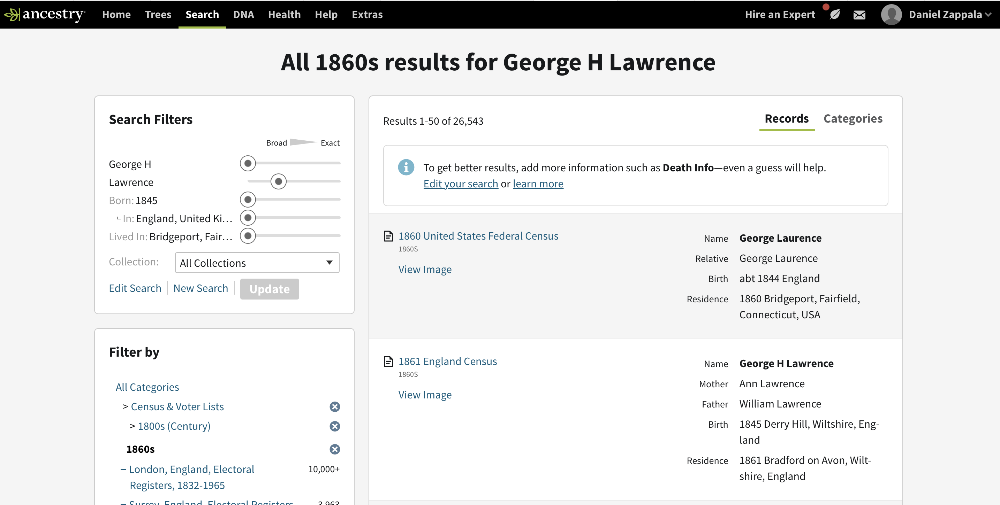
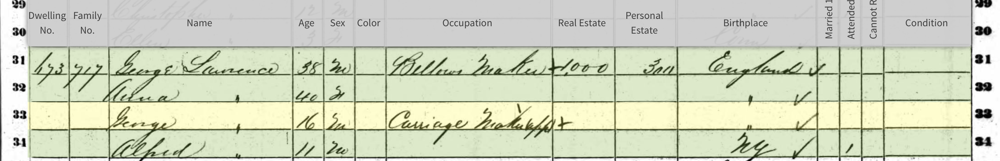
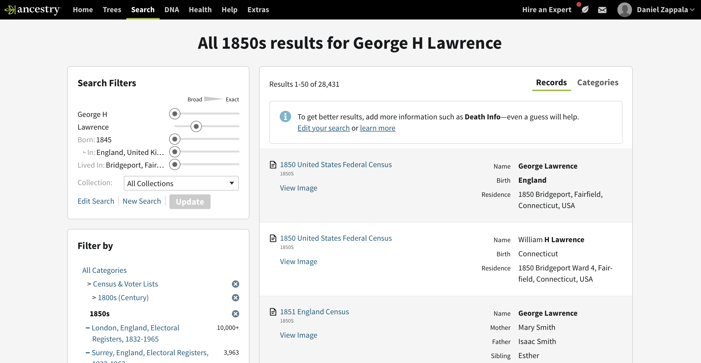
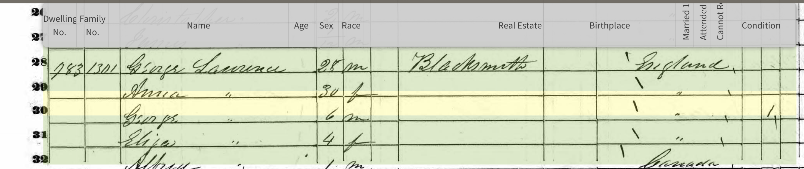

You may notice we skipped the 1890 census. This is because [nearly all records of this census were destroyed in a 1921 fire](https://www.census.gov/history/www/genealogy/decennial_census_records/availability_of_1890_census.html).
Because of the loss of the 1890 census, the 1880 census is particularly important.

We are going to follow George and Emma Lawrence in the 1880 through 1850 census records. George and Emma are the uncle and aunt of Daisy Juchau, who we covered in the [1940 through 1900 censuses](./united-states-census-1940-to-1900).

## 1880 Census

In addition to telling where your family lived, how old they were, and who they lived with, the census also lists a persons race in a few categories (White, Black, Mulatto, Chinese (East Asian), and American Indian), their occupation and months employed that year, whether they were sick or disabled, their birthplace, and the birthplaces of their parents. For additional details on the questions asked, see
[Questions Asked on the 1880 Census](https://www.census.gov/history/www/through_the_decades/index_of_questions/1880_1.html).

Let's search for George and Emma Lawrence in the 1880 census. We know from the 1910 census that George H. was 65, Emma A. was 60, and their daughter Emma A was 22. This gives us an approximate birth date for George of 1845, and we also know from the 1910 census that he was born in England. Let's search the 1880 census for [George Lawrence, born 1845 in England, with a wife Emma](https://www.ancestry.com/search/categories/cen_1880/?name=George+H_Lawrence&birth=1845_England&count=50&spouse=Emma&types=r). The first match is for George H. Lawrence, living in Bridgeport, Connecticut, a great match.

Here are [George and Emma Lawrence in the 1880 census](https://www.ancestry.com/imageviewer/collections/6742/images/4240007-00748?treeid=&personid=&hintid=&usePUB=true&usePUBJs=true&pId=44607802):

George H. Lawrence, 35, and his wife Emma, 29, live with their children Alfred, 10, Harry, 8, and George W., 4. The family lives at 99 Hallam Street, Bridgeport, Fairfield County, Connecticut. This location has been redeveloped since then, but you can see where it was located in the map below. Hallam Street is just above Hamilton Street, running toward Yellow Mill Pond.

George Lawrence works in a sewing machine factory ("Works Sew'g M. Fcty."), Emma keeps house, and Alfred is at school. George was out of work for 6 months this year.

The rest of the census enumerates various conditions the family may have (sick, blind, deaf and dumb, idiotic, insane, disabled), whether they attended school (Alfred and Harry), and whether they are unable to read or write. It then lists their birthplace, along with the birthplace of their mother and father. George and Emma were born in England, as were their parents. The children were all born in Connecticut.

## 1870 Census

As we get farther back in time, the United States census begins to include less information. Because of this, we need to be sure we have the correct person. Let's review what we know about George Lawrence from the 1880 census:

- George Lawrence, 35, was married to his wife Emma, 29, with children Alfred, 10, Harry, 8, and George W, 4.
- The family lived at 99 Hallam Street in Bridgeport, Fairfield County, Connecticut.
- George worked in a sewing machine factory.
- George and Emma were born in England, and their children were all born in Connecticut.

As we go back 10 years, George and Emma may not be married yet. Their [1900 census record](https://www.ancestry.com/imageviewer/collections/7602/images/4118691_00539?usePUB=true&usePUBJs=true&pId=6950709) indicates they were married 30 years at that point, right about 1870, and the birth of their first child, Alfred, must have come shortly after that if he was 10 years old in 1880. So we may find them married without children in the 1870 census, married and with a young Alfred, or not yet married. We would expect to find them in Connecticut since all their children were born there.

My first step is to [conduct a search on the census records at Ancestry, filling in "George H. Lawrence", an approximate birth year of 1845, a birth country of England, and listing Bridgeport, Connecticut as a place he lived](https://www.ancestry.com/search/categories/35/?name=George+H_Lawrence&birth=1845_england-united+kingdom_3251&count=50&residence=_bridgeport-fairfield-connecticut-usa_56). Here are the first few search results:

The second result looks promising, but I recommend first narrowing down the search to the 1870 census, since that's what we're focused on. You can do this by clicking `1870s` in the menu at left.

Ancestry does a good job of putting the most relevant results at the top, and you can see the first result (the same as the second one in the previous search) is our best match. Here is what that record shows:

Is this the right person? George H. Lawrence is 25, working in a sewing machine factory, and was born in England. All of this fits perfectly with the 1880 census. Another person living in this household is Emma Lawrence, 19, born in England, which also matches with the 1880 census. Since this census does not list marriage status or relationships we have to make some assumptions here. Given that all this information matches, and there was no other obvious match for George in Connecticut, it is likely this is the same George and Emma we saw in the 1880 census as husband and wife. We could go a step farther, find their marriage records, and, if we can find Emma's maiden name, see if we can find her living with her parents in 1870 to try to rule this out as her. But given what we know so far, this is a pretty solid match.

What else does this census tell us? George's parents are George Lawrence, 49, and Emma Lawrence, 52, with a brother Alfred E., 21. George Senior works at a pump factory, Anna is performing domestic duties, and Alfred is working in a sewing factory. Their home is worth $250 and their personal estate is worth $150. Everyone was born in England, except Alfred, who was born in New York.

This gives us some additional helpful information. Since George, 25, was born in England, and Alfred, 21, was born in New York, we can narrow down the immigration of the family the the years 1845 to 1849. Notice that unlike the later United States Census records we have covered, there is no immigration year listed, so we have to figure it out with clues like this.

Finally, notice there is some additional information possible in this census. There is space for birth month and marriage month, though those are not listed for this family. There are columns for whether a person is attending school, cannot read or write, has a medical condition, is a male over the age of 21, and was denied voting.

This last question was particularly important, given the end of the Civil War and the ratification of [the 14th Amendment](https://constitution.congress.gov/constitution/amendment-14/). This [article from the New York Times](https://www.nytimes.com/2019/07/12/us/the-long-history-of-the-us-government-asking-americans-whether-they-are-citizens.html) explains the situation:

> When a citizenship question returned 40 years later, in the 1870 census, it was part of a baldly political scheme to address one consequence of the Civil War: Newly freed slaves had so expanded the population of the former Confederate states that the South was expected to gain 15 House seats in the reapportionment of 1871.

> The prospect that the defeated Southern states might actually be able to control both the House of Representatives and the Electoral College so alarmed Republicans that they included a clause in the new 14th Amendment to prevent it. Because Southern states were denying voting rights to freed slaves, the clause reduced the population base used to allot House seats, based on how many adult male citizens in a state had been denied the right to vote.

> Implementing that clause required adding a question about the citizenship status of adult males to the 1870 census, as well as a question about whether those citizens had been denied voting rights. But by the time the census took place, the 15th Amendment, which guaranteed voting rights to African-Americans, made the provision moot — and as the census soon showed, a population surge in the American West offset the South’s gains anyway.

Here is the full list of [questions asked in the 1870 census](https://www.census.gov/history/www/through_the_decades/index_of_questions/1870_1.html).

## 1860 Census

If we go back to our previous search for George Lawrence in all census records, and then click on the `1860s` link in the left menu, we can see [the records that Ancestry has matching that time period](https://www.ancestry.com/search/categories/cen_1860/?name=George+H_Lawrence&birth=1845_england-united+kingdom_3251&count=50&residence=_bridgeport-fairfield-connecticut-usa_56):

Again there is only one likely match, given the information we know about George Lawrence. If we click [that record](https://www.ancestry.com/imageviewer/collections/7667/images/4211334_00254?treeid=&personid=&rc=&usePUB=true&_phsrc=mgG4&_phstart=successSource&pId=14746270), we see:

George Lawrence, 16, is living with his parents, George Lawrence, 38, and Anna Lawrence, 40, and with his brother Alfred, 11. We can see that this matches well with the 1870 record, based on their ages, likely relatonships, and birth places. George Senior is a bellows maker and George is a carriage maker apprentice. Geoge Senior's estate is worth $1000 and his personal estate is worth $300.

Note that the Lawrence name has been spelled/indexed as Laurence here. Sometimes handwriting can make it difficult to distinguish these.

## 1850 Census

For the 1870 and 1860 census, we used [a search on the census records at Ancestry, filling in "George H. Lawrence", an approximate birth year of 1845, a birth country of England, and listing Bridgeport, Connecticut as a place he lived](https://www.ancestry.com/search/categories/35/?name=George+H_Lawrence&birth=1845_england-united+kingdom_3251&count=50&residence=_bridgeport-fairfield-connecticut-usa_56). We can then narrow this down by clicking `1850s` in the menu at left:

There is one good match for [George Lawrence living in Bridgeport, Connecticut](https://www.ancestry.com/imageviewer/collections/8054/images/4193073-00567?treeid=&personid=&rc=&usePUB=true&_phsrc=mgG11&_phstart=successSource&pId=18082081):

George is 6, living with his parents George, 28, and Anna, 30, and his sister Eliza and brother Alfred, 1. George Senior is a blacksmith. Alfred is listed as being born in Canada, with the rest born in England.

## Summary

We previously saw George and Emma Lawrence in the [1910 United States Census](./united-states-census-1910). Combining that record with this one, we know the following things about the Lawrence family:

- George Lawrence was born about 1845 in England and his wife Emma (maiden name not known), was born about 1850 or 1851, also in England.
- The 1910 census indicates they were married for 40 years (so married in about 1870). In the 1880 census their oldest child is 10, so they likely married about 1869. Since their children were born in Connecticut, it is possible they married in Connecticut.
- The 1910 census indicates that George immigrated to the U.S. in 1849 and Emma in 1869. They must have married soon after she came to the U.S., or they may have married in England and then came to the U.S. to have their first child.
- They have children Alfred (born about 1870), Harry (1872), George W. (1876), and Emma A. (1888). Because of the 30 year gap in census records, there are likely other children we have missed.
- George worked in a sewing machine factory in 1880 and as a machinist in a factory in 1910, so his career appears to have been mostly in the industrial sector.

Some of the next steps, were we to investigate this family more, would be to find them in additional census, starting with 1900 and looking also at 1920 onward. We can likewise go backward in the census to 1870. We would certainly cwant to look for immigration records and birth records in England. Finally, we would want to try to find a marriage record and find Emma's maiden name so we could track her family as well.
