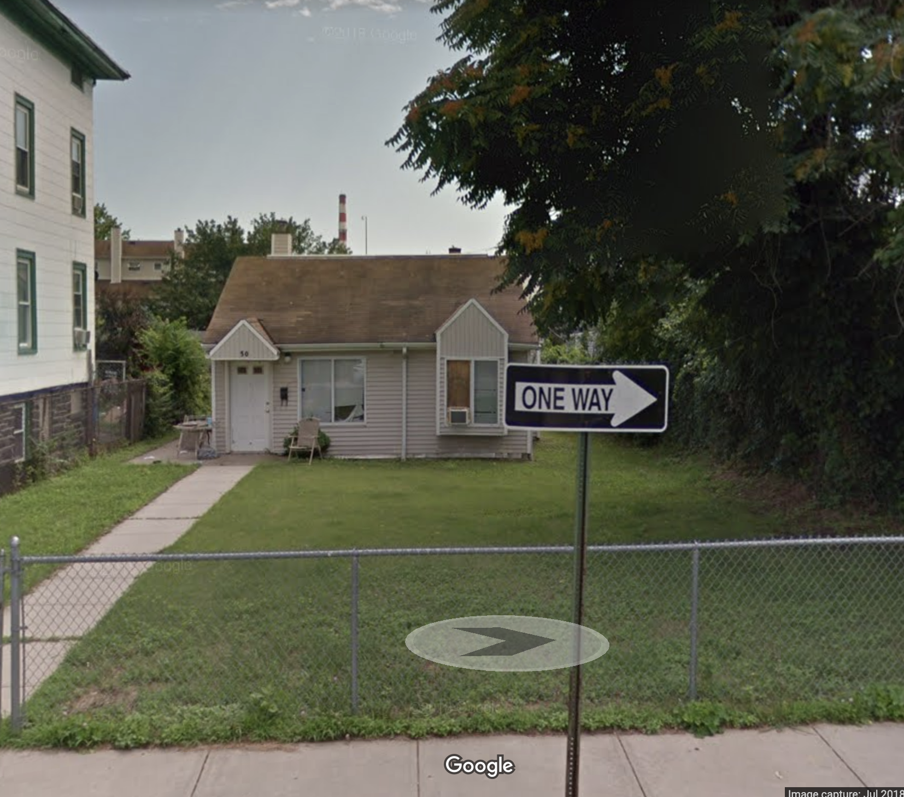

If your ancestors lived in the United States, the census is a great way to find additional information about them. Even if you know who all of your ancestors are, the census can help you learn more about their stories.

It is especially helpful if you can go backward in time through the census, since this is the easiest way to conduct research on your family, from most recent to more distant events. We'll cover census records from the 20th century in that order. Law in the United States allows census records to be made public after 72 years. This means the most recent available census is 1940, so we'll start there.

We will use [Ancestry.com](https://www.ancestry.com/) to look up census records and we will follow my great-grandmother, Daisy Campbell.

## 1940 census

The 1940 census can show you where your family lived, how old they were, who they lived with, their amount of schooling, where they were born, where they worked, and how much they earned. For additional details on the questions asked, see
[Questions Asked on the 1940 Census](https://1940census.archives.gov/questions-asked.asp).

To find someone in the census, first go to [Ancestry.com](https://www.ancestry.com), then click on the `Search` menu and select `Census & Voter Lists`. Enter what you know about the person. In my case, I put in the name of my great-grandmother, `Daisy Turner`, and that she lived in Bridgeport, Connecticut. If I searched for `Daisy Campbell`, I would not find her, since she was divorced and had married her second husband by this time. I know from my family that she lived in Bridgeport.

Once you do the search, this will return [records for Daisy Turner in all censuses](https://www.ancestry.com/search/categories/35/?name=Daisy_Turner&count=50&residence=_bridgeport-fairfield-connecticut-usa_56&types=r). You can use the menu on the left, labeled `Filter by` and select `1940s` to narrow this down. With this filter, there are only a [few possibilities listed in the search](https://www.ancestry.com/search/categories/cen_1940/?name=Daisy_Turner&count=50&residence=_bridgeport-fairfield-connecticut-usa_56&types=r), and she is the first one.

Here is [Daisy Turner in the 1940 census](https://www.ancestry.com/imageviewer/collections/2442/images/m-t0627-00500-00384?pId=133804430):

Daisy J Turner is married to Thomas Turner, with daughters Francis M. and Patricia D. You can see that they are listed as step-daughters of Thomas Turner, and a surname of Campbell is written in for Francis. This would be a clue to look into her first marriage, and other census records may tell us more. (It's not clear from the census whether Francis or Patricia used the Campbell surname since they both also have the horizontal line indicating the same last name as their step-father.) The X with a circle next to Daisy's name indicates she is the one the census taker interviewed.

The family is living at 421 Allyndale Drive in Stratfield, Fairfield, Connecticut. Note the street name is written sideways on the left side of the page. They own their home, and it is valued at $2,500. Here is how the home looks today:

Daisy and Thomas are both 51, Francis is 14 and Patricia is 11. Thomas attended up to 5th grade, Daisy and Francis 8th grade, and Patricia 5th. Thomas and Daisy were both born in England, with the daughters born in Illinois. Both Daisy and Thomas are naturalized citizens. The last boxes on the far right indicate they were living in the same house in 1935.

Moving over to the right, the rest of the census page shows that Thomas is working at a private firm during the week of March 24th-30th. He worked 40 hours as a carpenter in a brass factory. He worked 52 weeks during 1939 and earned $1456. The last column indicates he had income from other sources that was greater than $50.

Daisy was not working at a private firm, was doing housework, and her occupation was a dramatic teacher at a private school. She worked 0 weeks in 1939 but did have other income.

## 1930 Census

The 1930 census includes much of the same information as the 1930 census, but also shows where your relatives' parents were born, what year they immigrated to the United States, and whether they were a military veteran.
For additional details on the questions asked, see
[Questions Asked on the 1930 Census](https://www.census.gov/history/www/through_the_decades/index_of_questions/1930_1.html).

I am going to repeat the process above to search for `Daisy Campbell`, but I now know she was born in about 1889 in England since she was listed as 51 in the 1940 census. These reported dates are not always accurate, but this is the best we can go on for now. I am using Campbell for her last name since she was in her first marriage at this time.

When we conduct this search there is a [long list of results](https://www.ancestry.com/search/categories/cen_1930/?name=Daisy_Campbell&birth=1889_England&count=50&types=r). How do we know which of these might be correct? First, you can click in the `Filter by` menu to limit this to the US Census in 1930. To find this you have to click on `See more`. One we do this, we see [a long list of Daisy Campbells](https://www.ancestry.com/search/collections/6224/?name=Daisy_Campbell&birth=1889_England&count=50&pcat=cen_1930&types=r&viewMode=category&qh=88d52cb24bdc4906340f77e8a8eb99b1) in this census, but not many born in England and none of these are a good match since we don't see the right children (Patricia and Francis) listed.

A few things could cause this to happen. Maybe her first name wasn't spelled correctly in the census. Maybe her age is off. Luckily, Daisy has two daughters listed in the 1940 census that are old enough to have been alive in 1930. So let's click the `Edit Search` item on the left and instead search for `Francis Campbell`, born in 1926 in Illinois, with a mother named Daisy. You can see those [search results for the 1930 census](https://www.ancestry.com/search/collections/6224/?name=Francis_Campbell&birth=1926_Illinois&count=50&mother=Daisy&residence=_illinois-usa_16&types=r), and there is one strong match.

Here is [Daisy in the 1930 census](https://www.ancestry.com/imageviewer/collections/6224/images/4584604_00588?pId=26617998):

You can see that Daisy is listed as 35, or born about 1895, which is why she did not show up in the search earlier. If we had searched for her with a birth date of 1895 she would have been listed first. Alternatively, we could search for her with a birth of 1889 +- 10 years, living in Illinois (since that is where her kids were born), and she likewise would have been listed first.

Daisy Campbell is listed as married to James Campbell, with daughters Jean, Francis, and Patricia, and a son Kenneth. They also have John Coufal, a roomer, living with them. The family is living at 470 North Lake Street (the street is higher on the page) in Aurora, Kane, Illinois. They are renting their home for $55/month and they own a radio set. Here is how the home looks today:

Daisy is 35, James is 42, Jean is 16, Kenneth is 14, Francis is 4 and 5 months, and Patricia is 1 and 10 months. Daisy was born in England and her parents are listed as being born in France and England. Daisy, James, Jean, and Kenneth can all read and write, and the two older children are in school.

On the right side of the page we see that James and his parents were born in Ireland. Both Jean and Kenneth were born in Connecticut, while Francis and Patricia were born in Illinois. Before coming to the United States, Daisy spoke English and James spoke Irish. Daisy reported coming to the United States in 1902 and James in 1905. Both are naturalized (abbreviated as Na). Next, James is listed as being employed as a superintendent at a silverplate company.
This industry is coded as 7332. You can [look up occupation codes](https://stevemorse.org/census/ocodes.htm) at Steve Morse's website.

On the far right, you can see a notation ("No") that James is not a veteran.

## 1920 Census

The 1920 census, like other censuses, tells where your family lived, how old they were, and who they lived with. In addition, it lists the immigration year and year of naturalization, the country where they and their parents were born, their native language and that of their parents, and their occupation. For additional details on the questions asked, see
[Questions Asked on the 1920 Census](https://www.census.gov/history/www/through_the_decades/index_of_questions/1920_1.html).

Now that we are searching for Daisy for the third time in the census, we can be more precise with our search. Let's search for [`Daisy Campbell`, born in 1889, +- 10 years, in England, with a spouse of James](https://www.ancestry.com/search/categories/cen_1920/?name=Daisy_Campbell&birth=1889_england-united+kingdom_3251&birth_x=10-0-0&count=50&spouse=James&types=r). The first result is the right match.

Here is Daisy Campbell [in the 1920 census](https://www.ancestry.com/imageviewer/collections/6061/images/4293687-00480?pId=2343185):

Daisy, age 28, is married to James Campbell (31), and they have two children, Jean (6) and Kenneth (4 and 1 month). They are living at 1530 St. Charles in Alameda, Alameda, California. Here is what the house looks like today:

After the column that contains their ages and gender, you will see some columns that list their immigration date and naturalization status. For Daisy, the "Un" in immigration year indicates it is unknown, so whoever the census taker was interviewing may not have known it. Her naturalization status is "Na" for naturalized. James has an immigration year of 1907 and he was naturalized in 1915.

Next is a set of columns indicating whether the family members are in school and can read and write.

Moving to the right, we next see a section of the census that indicates where each family member was born and what language they speak, along with the same information for their mother and father. Daisy was born in England and speaks English, and the same for her parents. James was born in Ireland and his parents were both born in Scotland. This would be really helpful when tracing James Campbell's family! Knowing he is from Ireland, we might expect to see a long history with many generations there, as is typical for many immigrants, but in his case only one generation was in Ireland since his parents are from Scotland. The children were born in Connecticut, which could help us track down naturalization records for both James and Daisy.

Finally, the last part of the census shows James' occupation, which is silversmith, the industry where he worked, manufacturing, and his type of employment, which is "W" for wage.

## 1910 census

The 1910 census tells where your family lived, how old they were, and who they lived with. In addition, it lists their birthplace and the birthplace for each of their parents, along with their immigration year and naturalization status. It also lists their occupation, whether they are out of work, number of weeks worked, whether they own or rent their home, whether they live on a farm, and whether they are a veteran. For additional details on the questions asked, see
[Questions Asked on the 1910 Census](https://www.census.gov/history/www/through_the_decades/index_of_questions/1910_1.html).

### Finding a maiden name

Searching for Daisy in the 1910 census is going to be tricky, because she would have been about 18 (she was listed as 28 in the 1920 census), and likely not yet married to James Campbell. What was her maiden name? We don't even know where she was living, since she was in Bridgeport, Connecticut in the 1940 census, then Aurora, Illinois in 1930, and Alameda, California in 1920. One possibility would be to try each of these cities as a location and see if we find a match.

In this case, the best thing to do is to try to find a marriage record, which would usually list the bride's maiden name. On Ancestry, you can [search for a marriage record](https://www.ancestry.com/search/categories/bmd_marriage/?name=Daisy&birth=1892_England-United+Kingdom&count=50&marriage=1915&marriage_x=5-0-0&residence=_bridgeport-fairfield-connecticut-usa_56&spouse=James_Campbell) given what we know -- first name Daisy, born around 1892 in England, lived in Bridgeport, Fairfield Connecticut, and married James Campbell in 1915, plus or minus 5 years:

The third and fourth results are strong matches. The first is a marriage to a James Cunningham, the second is a marriage to a James Raynor. The third and fourth results are for the same marriage of a Daisy M Juchan to a James C Campbell. We know their oldest child, Jean, was born about 1914, so a 1912 marriage makes sense. We could order this marriage record from New York City, and by matching information on this record with information about James Campbell, could ascertain that this is the right person. For now, let's assume this is correct.

Finally, sometimes the easiest thing to do is to confirm information with a living relative. Talk to your parents and grandparents to find out what they know!

### The 1910 census record

Searching for [Daisy Juchan, born 1889 in England in the 1910 census](https://www.ancestry.com/search/categories/cen_1910/?name=Daisy_Juchan&birth=1889_england-united+kingdom_3251&count=50&types=r) doesn't yield good results. But maybe that last name is spelled wrong, either on the marriage record or the census. It's a pretty unusual name. So let's instead search for [Daisy Juch\*, born 1889 in England in the 1910 census](https://www.ancestry.com/search/categories/cen_1910/?name=Daisy_Juch*&birth=1889_england-united+kingdom_3251&count=50&types=r). The `*` is called a wildcard, and means we search for any last name starting with `Juch`. You could even search for any last name starting with a `J`. Doing this search shows a really good first match, for `Dazie M Juchaw`, living in Bridgeport.

Here is [Daisy in the 1910 census](https://www.ancestry.com/imageviewer/collections/7884/images/31111_4327332-00644?pId=187411251):

You can see some interesting things in this census. Daisy is living with the Lawrence family, George H., 65, Emma A., 60, and their daughter Emma A, 22. Minnie V. Juchaw, 18, and her sister, Dazie M. Juchaw, 22, are neices of George Lawrence. Living with an uncle is somewhat unusual, and this could be for a variety of reasons. Exploring this requires looking at other records later.

The family is living at 260 Nichols Street, Bridgeport, Fairfield, Connecticut. The home is no longer there today -- Interstate 95 was built through the backyards of the homes, so that could explain it.

We next reach a few things in the 1910 census that are different from 1920. First, it lists "M1" for the marital status, indicating that George and Emma Lawrence have each been married once (to each other). It also shows the number of years they have been married -- 40. Finally, it lists how many children have been born to a mother and how many are still living. Emma had 12 children, with 5 living.

Moving to the right, we see George and Emma Lawrence were both born in England, as were their parents. Their daughter Emma was born in Connecticut, while Minnie and Dazie were both born in England, as were their parents. George immigrated in 1849 and is Naturalized. His wife Emma immigrated in 1869, Minnie came in 1899, and Dazie came in 1900. Note that immigration dates can be wrong because they rely on the memory of the person being interviewed, so these should be double-checked with immigration records. They can also be cross-checked with other census records.

In the last part of the census we see that George is a machinist in a factory and earning a wage. He is out of work as of April 15th and was out of work for 24 weeks in 1909. His wife Emma does not work and his daughter Emma is a press hand at a factory, earning a wage, and currently working. Minnie is a stenographer at a beef company, earning a wage, and currently working. Dazie is a winder at a plush shop (a shop that sells stuffed animals). She was not out of work as of April 15th, but was out of work for 8 weeks in 1909. All of them can read and write, and Minnie attended some school in 1909.

George owns their home free, with no mortgage, and it is a house (not a farm).

The last numbers you see written here are not recording data for the listed column names but were used when entering the data from the census onto punch cards for tabulation.

## 1900 census

The 1900 census, like other censuses, tells where your family lived, how old they were, and who they lived with. In addition, it lists the birth month and birth year for each resident, something other United States census records don't have. It also lists how many years someone has been married, how many children a woman has had and how many are still living, the birthplace of each resident as well as their parents' birthplaces, their immigration year and naturalization status, their occupation, literacy, and home ownership.
For additional details on the questions asked, see
[Questions Asked on the 1900 Census](https://www.census.gov/history/www/through_the_decades/index_of_questions/1900_1.html).

Searching for Daisy Juchaw in the 1900 census is pretty easy, since we know her maiden name and approximate birth date. A search for [Daisy Juchaw, born about 1888 in England, living in Bridgeport, Connecticut](https://www.ancestry.com/search/categories/cen_1900/?name=Daisy_Juchaw&birth=1888_england-united+kingdom_3251&count=50&residence=_bridgeport-fairfield-connecticut-usa_56&types=r) gives us one good match.

Here is Daisy Juchau [in the 1900 census](https://www.ancestry.com/imageviewer/collections/7602/images/4118691_00535?pId=6950477):

Notice the different spelling of Juchau -- this is the correct spelling as subsequent record searches will show. Daisy is living with the Cook family, Thomas S., 49, Mariam, 47, and their children Lilliam S., 19, Ivy Rose, 16, Thomas S., and 7. Daisy Juchau, 11, Thomas C. Juchau, 10, and Marie Juchau, 7, are nieces and nephews of Thomas Cook. In the 1920 census Daisy and Minnie were living with a different uncle, George Lawrence, so there is likely an interesting story here.

The family is living at 50 Cedar Street in Bridgeport, Fairfield, Connecticut. This is what is at the location today, but it may not be the same house:

Notice that to the right of Sex is the birth month and year for each person -- Thomas in March 1851, Mariam in November 1852, Lilliam in August 1881, Ivy Rose in April 1884, Thomas Jr. in March 1893, Daisy in September 1888, Thomas Juchau in May 1890, and Minnie in December 1892. This is really useful information, as it could help us track down additional records for the family. Knowing the birth month and year is particularly helpful for English birth records.

Next to this we see that Thomas and Mariam Cook have been married for 30 years and Mariam had 7 children, with 3 currently living.

The next columns list the birth places for everyone and their parents -- these are all England. Everyone is listed as having immigrated in 1899, and Thomas Cook has not been naturalized (the "Al" stands for alien).

Thomas is a bricklayer and was not employed for 3 months in the last year. His daughters Lilliam and Ivy Rose stitch corsets and were out of work 11 months last year. Daisy and Thomas Juchau attended school for 4 months last year. Everyone can read, write, and speak English and the family is renting a house.

## What have we learned

We know a lot about Daisy and her family now. Imagine we had been starting from scratch to learn more about her. The census tells us:

- The census reliably tells us that Daisy was born in England, and we can surmise a variety of birth years, from 1888 to 1895. The 1900 census has the specific information that Daisy was born in September 1888.
- The first census records we saw indicated Daisy immigrated from England in 1900 or 1902. Once we made it back to the 1900 census we could see that these immigration years are unlikely since she was in America in the 1900 census, and this census tells us she immigrated in 1899.
- Daisy has been naturalized as a citizen of the United States,
- Daisy has been married twice. She first married James Campbell, sometime between 1910 and 1920, and she lived with him in Alameda, California and Aurora Illinois. She later married Thomas Turner, sometime between 1930 and 1940 and lived with him in Connecticut.
- Daisy has at least four children, Jean, Kenneth, Francis, and Patricia.
- Daisy likely came directly to Connecticut to live with her uncle and aunt, Thomas and Miriam Cook, before moving in with her other uncle and aunt, George and Emma Lawrence, before 1910.

We also know some details about her husbands and their employment.

Overall, the census has given us some excellent information track down both Daisy's immigration record and her birth record in England.

We also could track both the Cook and Lawrence families in England. Since the Lawrence family was in America in 1880, they came much earlier than the Cook family did in 1899. Tracking the family in England could be helpful since they probably lived near the Juchau family there.

Finally, a few words about dates and ages. These are not necessarily accurate! These are based on whoever reported the information, and they may not know or remember the dates and ages correctly. For example, Daisy is listed as 51 in 1940 and then 35 in 1930. Generally ages are reported more accurately the closer a census is to someone's birth year. Further research in the census helped us narrow down Daisy's birth year and then eventually the 1900 census listed her exact year and month of birth. This should also be confirmed by finding a birth certificate where possible.
