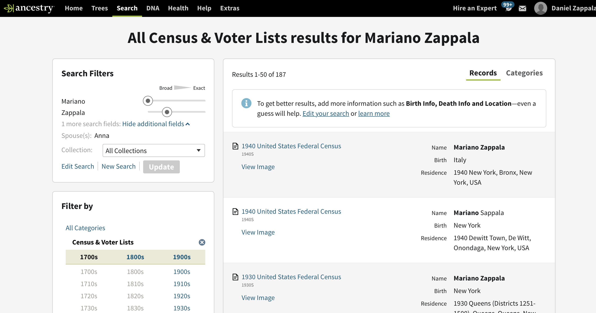
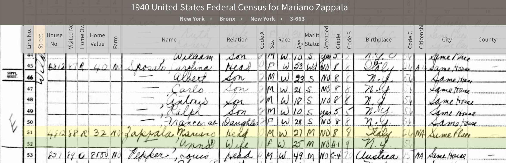
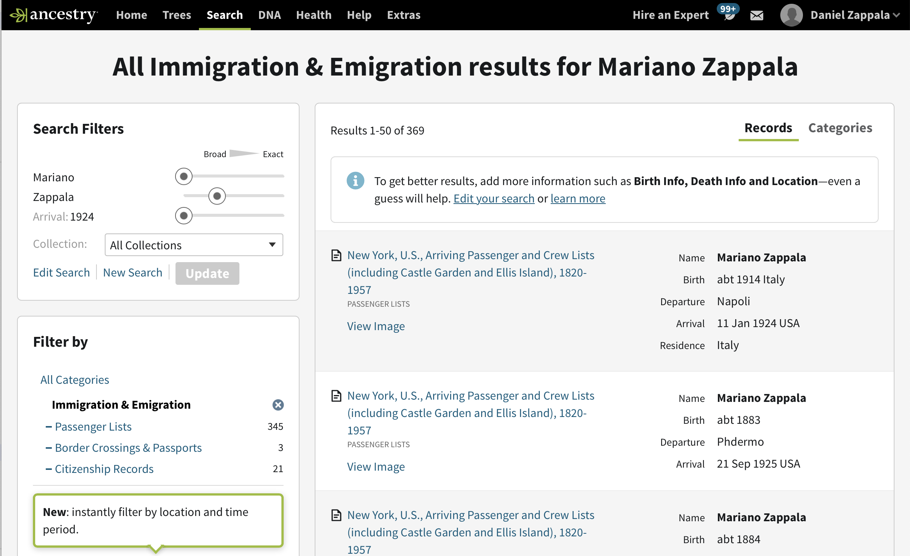

If your family immigrated to the United States, then at some point you will likely want to find which country they came from. It is especially helpful if you can find the city they lived in, so you can continue tracing your family from there.

We'll walk you through an example of how you could find where one of your ancestors came from. Daniel's grandparents, `Mariano and Anna Zappala` lived in New York City. Imagine we know they came from Italy but don't know which town they were from. This is how we would find where they originally came from.

## 1940 census records

A good place to start is the 1940 census. Why not jump straight to immigration records? Well, you may know only a little
about the person to start with -- maybe you know the names of your grandparents and not much else. To find the correct immigration information, it helps to know more about your ancestor first. The more you know, the more you can correlate all this information to be sure you have found the right records, and discount those that aren't a good match.

You can search the 1940 census on [Ancestry](https://www.ancestry.com/search/?name=Mariano_Zappala&count=50&spouse=Anna):

Notice that we put in just their names -- you could add more information if you knew it. You can see the 1940 census is the third result shown

You can click on the `Census and Voter Lists` link under `Filter by` to narrow down the results to just the census:

and you could narrow it down further by year if desired. If you click on `View Image` for the first 1940 census result, you will see the [record for the family](https://www.ancestry.com/imageviewer/collections/2442/images/m-t0627-02478-00042?treeid=&personid=&rc=&usePUB=true&_phsrc=bkB2&_phstart=successSource&pId=13490225):

How do we know this is the right family? We know Daniel's grandparents lived in New York City, and there is no other Mariano Zappala, with a wife Anna, living in the city in the 1940 census. We also could ask Daniel's dad about Mariano's brothers and sisters, to see if any would have been born before 1940 -- there weren't, so that matches with this record. You may need to do some detective work to find the right record.

We can see from what is shown that Daniel's grandfather was 27, his grandmother was 25, they are married, with no children currently living with them, and that he was born in Italy and she was born in New York. So we know from this what country Daniel's grandfather was born in, but not what city.

There is other useful information to fill in their life here too -- he had school only up to 8th grade, and she only had 1 year of high school, he is working as a clerk in the , and she is a typist at the federal building. They rented a part of a home in the Bronx, at 4812 Wilder Avenue:

You should also look at the other people living nearby. In the lines just above, you can see that they are living with Carolina Sposato, a widow, and her children. This is Anna's mother.

## 1930 census records

We know that Mariano came from Italy, but it would be helpful to get more specific information. Let's check out the 1930 census.
Back on the search results, which we narrowed down by clicking on `Census and Voter Lists`, we can further click `1930s` to see
just [the census results from that decade](https://www.ancestry.com/search/categories/cen_1930/?name=Mariano_Zappala&count=50&spouse=Anna):

Unfortunately, the result shown there is not the correct one -- he should be 17, not 24, and he did not live in Queens.
If we narrow our search further, by clicking on `1930 United States Federal Census`, then we get only [the 12 matches in that census](https://www.ancestry.com/search/collections/6224/?name=Mariano_Zappala&count=50&pcat=cen_1930&spouse=Anna&qh=c588a989f5bd85108aa1c170fa150330):

The second search result looks like a good match, since the family is in the Bronx, like they were in 1940. The reason why this result did not come up right away is that Mariano was mistakenly listed as Marian and a daughter. Let's click on [that record](https://www.ancestry.com/imageviewer/collections/6224/images/4661134_00714?backlabel=ReturnSearchResults&queryId=8f454ec07bd1d660a5dd99a1c05674af&pId=30535754):

The family here is Carmillo Zappala (actually Carmelo) and Lucy, with their children Anthony, Albert, Mary, Cecilia, and Marian (actually Mariano). If you click on the `View Record` link in the search results you can correct the bad information.

In addition to learning more about Mariano's family, we can see that he immigrated to the United States in 1924 with his mother and siblings, whereas his father came in 1910. While we still don't know where in Italy he was from, this information will help us narrow down immigration records.

## Immigration records

If we return to the original search page for Mariano and Anna Zappala, we can click the link for `Immigration & Emigration`, we can search specifically these records. We can also click the `Edit Search` link to add 1924 as his arrival year. Finding this in the census first before looking at immigration records is helpful! We can now see [these search results](https://www.ancestry.com/search/categories/40/?name=Mariano_Zappala&arrival=1924&count=50)]:

The first result looks like the only match for 1924, so let's click on [that record](https://www.ancestry.com/imageviewer/collections/7488/images/NYT715_3440-0229?treeid=&personid=&rc=&usePUB=true&_phsrc=Rsc13&_phstart=successSource&pId=4029140239):

You can see three children in this record -- Maria, Mariano, and Cecilia Zappala'. Note the grave accent on the end, normally written Zappalà, which is how the name is spelled in Italy. These names match the siblings listed in the 1930 census and their ages also match up, accounting for the 6 years difference in the records. If you look above Maria's name, there is a handwritten notation that says "mother wife US Citz", so it appears that their mother may be a U.S. citizen.

They sailed on a ship called the S.S. Conte Verde, leaving from Napoli on 31 December 1923, arriving in New York on 11 January 1924. Notice the abbreviation for December (Dic) and January (Gen) are from the Italian names for the months (dicembre and gennaro).

Column 11 lists their last permanent residence, and theirs is listed as Italy, Sersale. So we know the town they were living in prior to their immigration! Many times this would be the town the family had lived in for several generations. The next column lists their nearest relative in their country of origin, in this case a grandfather Natale Grillo, living in Sersale. This is also helpful information, since it tells us their mother's maiden name is Grillo.

Depending on the year, immigration records may have multiple pages. If you click on the next page arrow, you can find the next page for this record:

Remembering that they are on lines 27--29, you can see that they have never been to the U.S. before and that they are traveling to visit their father, Carmelo Zappalà, American citizen, who lives at 356 E. 116th St, New York, NY. This is what that building looks like today:

This is an image from [oldnyc.org](https://www.oldnyc.org/#715126f-a) showing a building with the same architecture across the street in 1929:

Back to the census -- notice that the mother of the family -- Lucy Zappala nee Grillo -- is not listed on the same page as the children! This is likely because she was a U.S. citizen and thus listed in a different page of the ship manifest. If we return to the search page for immigration records and replace Mariano's name with Lucy, keeping 1924 as the year of arrival, we get this record:

Notice this is for the same ship, same dates, but the header at the top of the page is a "List of United States Citizens". Above Lucia's name is the the handwritten notation "3 children" and "30-27-29", which means page 30, lines 27 to 29 is where the children are listed. A notation on her line is "W 342709". This is probably a naturalization certificate number. The next column indicates Lucia was naturalized by her husband's citizenship. Her address in the U.S. is listed as 2167 First Ave., New York. It is curious that this is different from the address listed for the children, though it is nearby (about a 5 minute walk).

## Next steps

OK! So we found that Mariano Zappala immigrated to the United States from Italy in 1924. We know he came from Sersale, a small town in southern Italy. And we now know his parents are Carmelo Zappalà and Lucia Grillo, and he has siblings Maria, Cecilia, Anthony, and Albert. Maria and Cecilia were also born in Italy. Based on the 1924 immigration record, Mariano was born about 1914, though dates in secondary records like the census and ship manifests can be off.

The next step is to look for a birth record for Mariano in Italy. It turns out that [civil records for Sersale are microfilmed by the Family History Library up to 1910](https://www.familysearch.org/search/catalog/679912?availability=Family%20History%20Library) so we would need to write away for his record. Having all this additional information about his parents, his approximate age, etc. would help a lot when writing to Italy to be sure we could get the correct record. In addition, this extra information could help us find birth records for his older sibling, and certainly would help us find a marriage record for his parents.
